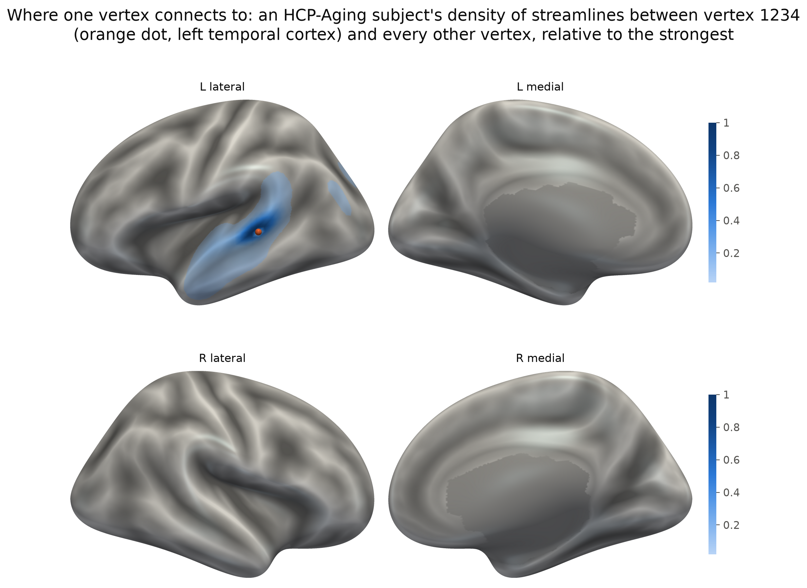
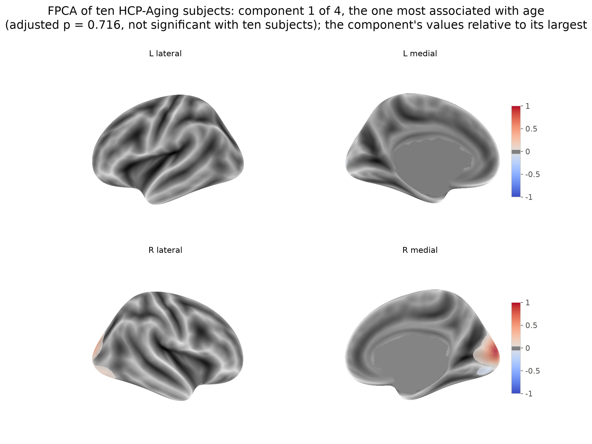
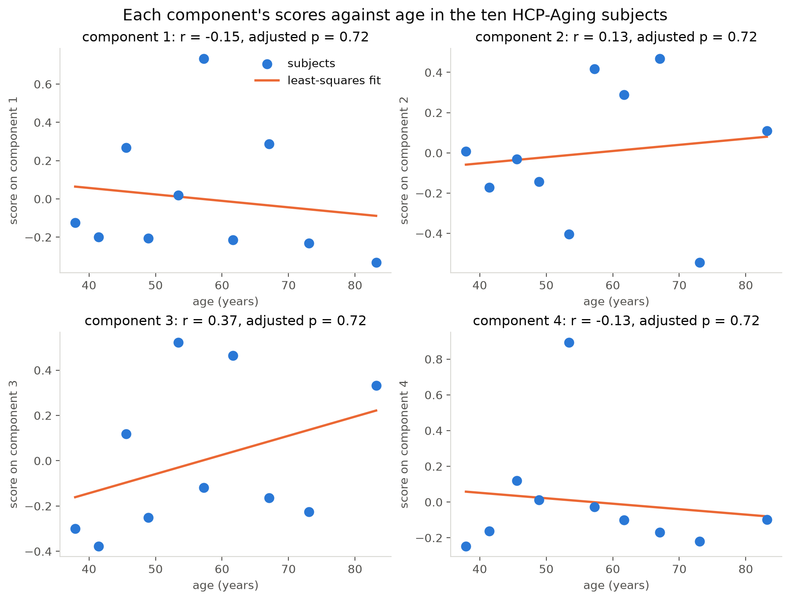
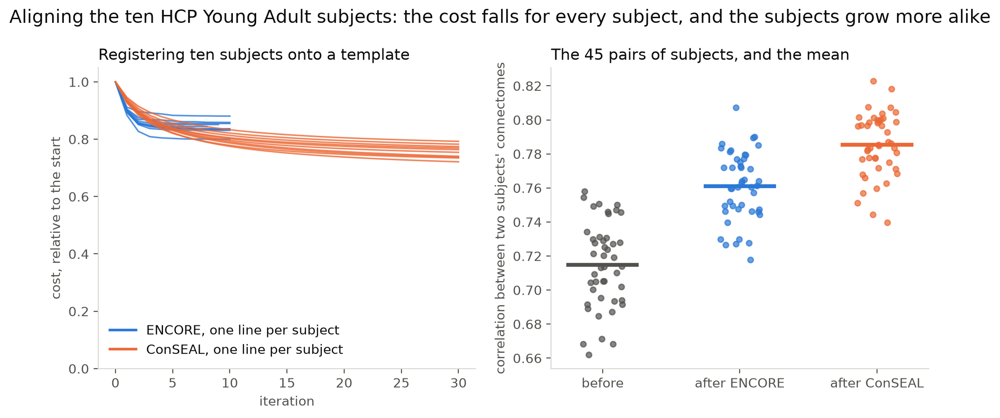

# sbci

Continuous brain connectivity: read, parcellate, smooth, couple, align and
reduce surface-based continuous connectomes on the ico4 grid (5124 vertices),
with every method a verified port of the SBCI group's MATLAB.

> **Status: pre-alpha.** Every method in the API table below is implemented
> and verified against its reference; only `sbci download` waits on the data
> release.

## Install

Python 3.10 or newer. The package is not on PyPI yet, so install from GitHub:

```bash
pip install "sbci @ git+https://github.com/xya2001/SBCI.git"             # core: numpy, scipy, h5py, nibabel
pip install "sbci[plotting] @ git+https://github.com/xya2001/SBCI.git"   # adds matplotlib and nilearn for figures
```

On UNC's Longleaf cluster use `scripts/setup_longleaf.sh` instead; see
*Development on Longleaf* below.

## Try it in two minutes

No data is needed: the package builds a synthetic connectome on the real grid.

```python
import sbci

cc = sbci.example()                  # synthetic, on the real ico4 grid; a couple of seconds
cc.to_atlas("Schaefer200").shape     # (200, 200)
cc.plot(cc.seed(vertex=1234))        # a figure; needs the plotting extra
cc.smooth(kernel="shk", mask_medial_wall=True)     # re-smooths its 20,000 endpoints: gives cc back
sbci.endpoints_align([cc, sbci.example(seed=1)], max_iterations=5)   # ConSEAL on two synthetic subjects
cc.save("sub-example_sc.h5")
```

Or from the shell:

```bash
sbci example --out sub-example_sc.h5      # write one to disk
sbci info sub-example_sc.h5               # what it holds
sbci validate sub-example_sc.h5           # nine checks, all should pass
sbci atlases --match Yeo                  # the bundled atlases
```

The grid, the vertex areas, the medial-wall mask and the file format are real;
the connectivity is generated: 20,000 streamline endpoints drawn at random
around smooth bumps on the sphere, kept only where they land in cortex, and
smoothed with the default kernel exactly as `smooth()` does it. The example
carries those endpoints, so re-smoothing and ConSEAL have something to work on
without lab data. A file written this way passes every `sbci validate` check,
so it is a faithful subject for learning the API, writing tests and checking a
plotting stack -- and never a basis for a claim about brains. Its metadata
records `pipeline_version` as `synthetic-example` and says the endpoints were
drawn, not tracked.

The figures in this README are not from the synthetic example. They are drawn
from ten HCP-Aging subjects, 38 to 83 years old, converted from the lab's
pipeline output with `tools/build_hcp_cohort.py` and drawn on FreeSurfer's
fsaverage surface with `plot(mesh="fsaverage")`; `scripts/hcp_figures.py`
regenerates them, and [docs/figures](docs/figures/README.md) describes each.



*`cc.plot(cc.seed(vertex=1234), mesh="fsaverage")`: where one vertex of one
subject connects to. The value at each vertex is the density of streamlines
between the seed (the orange dot, left temporal cortex) and that vertex,
relative to the strongest, on the inflated surface shaded by sulcal depth.*

**What smoothing does.** Tractography gives endpoints. One subject's 903,797
streamlines were split into two random halves; 576 of them touch vertex 1234
in one half and 569 in the other. With this many streamlines a single vertex
is already well sampled, so the two halves' raw counts agree across the
cortex at r = 0.96; once smoothed they agree at r = 1.00, and each half's
map matches the map from all streamlines at r = 0.98. The synthetic example
shows the other regime: with 20,000 streamlines only six and ten touch the
vertex, the two draws' raw counts share nothing (r = 0.00), and smoothing
still brings their maps to r = 0.89. Either way, smoothing is what makes two
subjects, or two sessions, comparable vertex by vertex.


*Top: the far ends of the streamlines that touch the vertex (blue dots), in
the two halves and in the whole set. Bottom: the smoothed density of the same
vertex from each, relative to its strongest vertex.*

## With real data

```python
import sbci

cc = sbci.load("sub-100307_sc.h5")     # a computational file from the pipeline, or from tools/import_legacy.py
M  = cc.to_atlas("Schaefer200")        # 200 x 200 matrix
p  = cc.seed(vertex=1234)              # profile on the surface
cc.plot(p)                             # inflated-surface figure
cc.to_cifti("sub-100307_sc.dconn.nii") # opens in Workbench; 16.9 GB
```

`sbci download hcp-ya --subject 100307` will fetch a subject once the data
release exists (SPEC_QUESTIONS.md item 6); until then, convert existing
pipeline output with `tools/import_legacy.py` (see *Using legacy pipeline
output*). Running the lines above on a machine none of us configured, from a
blank environment, in under five minutes is the acceptance criterion for this
package. It is encoded in `tests/test_five_minute_start.py`, which skips until
the release exists.

## The documents

| Read | For |
| --- | --- |
| [USAGE.md](USAGE.md) | every working function with a worked example, and what each error tells you |
| [BLUEPRINT.md](BLUEPRINT.md) | what the package is, what "finished" means, where it stands, and the decisions it waits on |
| [PORTING.md](PORTING.md) | how each of the seven MATLAB methods was ported and verified, and the errors found in the references |
| [SPEC_QUESTIONS.md](SPEC_QUESTIONS.md) | the file-format decisions, answered and open |
| [VERIFICATION.md](VERIFICATION.md) | how to check every claim yourself, in tiers from five minutes to a MATLAB licence |
| [scripts/](scripts/README.md), [tools/](tools/README.md) | worked scripts (with the lab's Longleaf paths) and the builders of the bundled data |

## API

| Call | Status |
| --- | --- |
| `sbci.load(path)` | implemented; the `.h5` computational file, validated on read. The `.dconn.nii` exchange file is write-only: its resampling to fsLR-32k is many-to-one |
| `ContinuousConnectome.load(path)` | the same thing, if you prefer the class |
| `.save(path)` | implemented |
| `.to_atlas(atlas, how="mass"\|"mean")` | implemented; takes an `Atlas` or a name such as `"Schaefer200"`; matches `parcellate_sc.m` to float64 rounding |
| `.seed(vertex=...)` / `.seed(region=...)` | implemented; `region=` takes a vertex mask or an `(atlas, region)` pair |
| `.coupling(fc, scope=...)` | implemented; matches the MATLAB to float64 rounding |
| `.plot(values, surface=...)` | implemented; inflated, white, pial and sphere bundled |
| `.to_cifti(path)` | implemented; fsLR-32k dense connectome, 16.9 GB |
| `sbci validate <file>` | implemented |
| `.smooth(kernel=..., bandwidth=..., eigenpairs=...)` | implemented for all three kernels. `shk` is the default and reproduces `concon` at r = 1.000000 across five subjects; `rdk` matches MATLAB to 3.25 float32-eps, `matern` is checked against its closed form (no MATLAB reference exists), and both find the Laplace-Beltrami basis via `$SBCI_LBO_DIR` (PORTING.md items 1 and 6) |
| `sbci.migrate_warp(warp, to="fs_LR_32k")` | implemented; carries an ENCORE or ConSEAL warp to fs_LR (MSMAll's sphere) or full-resolution fsaverage and writes it as a deformed sphere for Workbench (USAGE.md) |
| `.reduce(rank=K)` / `sbci.reduce(cc_list, rank=K)` | implemented; matches the MATLAB reference to float64 rounding (PORTING.md item 5) |
| `sbci.align(cc_list, method="encore")` | implemented; geometry and template match MATLAB to float64 rounding, the registration to r = 0.99999979 (PORTING.md item 4) |
| `sbci.endpoints_align(cc_list)` | implemented; ConSEAL, which warps the streamline endpoints themselves. Every stage matches the public MATLAB to the single precision it carries; four errors in that reference are corrected by default and reproducible with `strict_upstream=True` (PORTING.md item 7) |
| `sbci.stats.local_test(scores, design)` | implemented; **no reference exists**, so verified against `scipy.stats` and against the procedures' own guarantees (PORTING.md item 5) |
| `sbci.example(modality="sc"\|"fc")` | implemented; synthetic connectivity on the real grid, smoothed from 20,000 synthetic streamline endpoints it carries, so `smooth()` and `endpoints_align()` run on it; passes `sbci validate` |
| `sbci.example_cohort(n_subjects, seed, effect)` | implemented; a synthetic cohort with shared anatomy, individual variation and one bundle scaled by a synthetic age, so `reduce`, `local_test` and the alignments can be run against a known answer |
| `sbci info <file>` | implemented; what a file holds, without opening Python |
| `sbci example --out <file>` | implemented; writes a file to try the package on |
| `sbci atlases [--match ...]` | implemented; lists the bundled atlases and their region counts |
| `sbci download` | pending the data release (SPEC_QUESTIONS.md item 6) |

## An end-to-end analysis without data

One subject exercises the single-subject methods. The cohort methods need
subjects that share anatomy and differ in a known way, which is what
`sbci.example_cohort()` builds: every subject draws its streamlines around the
same bundles, jittered in weight and position, and one bundle's weight scales
with a synthetic age. The whole pipeline then runs against a planted answer:

```python
import sbci

cohort = sbci.example_cohort(n_subjects=10, seed=0)     # about 20 s; 52 MB per subject
reduction = sbci.reduce(cohort.connectomes, rank=4)      # FPCA, one to three minutes depending on the node
result = sbci.local_test(reduction.scores, cohort.age)   # which components track age?
result.significant()                                     # one of the four components
effect = result.effect_map(reduction, alpha=0.05)        # where on the cortex the effect sits
cohort.connectomes[0].plot(effect)                       # compare with cohort.truth, the planted bundle
```

On our runs one of the four components carried the planted bundle (which one
varies with the solver's start): its scores correlate with age at 0.95, the
adjusted p-value is 1e-4, and the effect map restricted to significant
components correlates 0.94 with `cohort.truth`. The effect is deliberately
not the largest source of variance -- `effect=0.5`
slips past a rank-4 FPCA, and three degrees of anatomical jitter
(`anatomy=0.05`) hides even the default, which is the case the alignment
methods exist for. Alignment fits in front of `reduce`:
`sbci.endpoints_align(cohort.connectomes)` warps every subject's endpoints
onto a common template, `aligned_endpoints(i)` hands them back, and
`smooth()` turns them into aligned connectomes (USAGE.md shows the three
lines). Timings are for four cores.

**Alignment, with a known answer.** One HCP-Aging subject's 903,797
endpoints were moved by a known smooth warp, a degree on average and four at
most, and the deformed copy was registered back onto the original. ENCORE
halves its cost, but the warp it finds points only half the way of the
deformation (cosine 0.50 with the true field), so undone through its inverse
it brings the endpoints back only from 0.95 to 0.92 degrees. ConSEAL, with
the paper's update rule and a stopping threshold of 1e-7, brings them to
within 0.13 degrees, undoing 86% of the displacement and 99% of the cost. On
the synthetic subject, with 20,000 streamlines, ENCORE's field agrees with
the truth at cosine 0.86 and undoes 59%, ConSEAL 82% (PORTING.md items 4
and 7).


**Alignment and the analysis.** Turn the cohort's anatomical spread up to
three degrees (`example_cohort(anatomy=0.05)`) and the planted bundle is
still the largest single component of the cohort, but the FPCA's default
start, a power iteration inherited from the reference, no longer reaches it;
`sbci.reduce(..., candidates=6)` does. Aligned with ENCORE first, the bundle
comes out as the first component at every spread tried. ConSEAL keeps it too,
except with an unregularized update (no clamp, no viscosity) onto a template
that has collapsed onto one subject, which can align the difference away; the
default regularization or a mean template keeps it. PORTING.md items 5 and 7
have the table.

**The same pipeline on the ten HCP-Aging subjects.** A rank-4 FPCA with
`candidates=6` and `local_test` against the subjects' ages find no
association: the adjusted p-value is 0.72 for every component, and the
scores' correlations with age run from -0.15 to 0.37. That is the expected
answer for ten subjects, and it is why the synthetic cohort, with its planted
effect, is where the pipeline is checked; the real cohort shows what the
outputs look like.



*The FPCA component most associated with age in the ten subjects (component
1 of 4), relative to its largest value: a small occipital field, and not
significant.*



*The four components' scores against age, with the least-squares fit and the
adjusted p-value of each.*

**Aligning the ten subjects.** Registered onto a template estimated from the
cohort, the subjects grow more alike: the mean correlation between two
subjects' connectomes rises from 0.700 to 0.754 after ten ENCORE iterations
and to 0.789 after thirty ConSEAL iterations, and the cost falls for every
subject. One caveat on this run: ConSEAL's Karcher median settled on one of
the ten subjects (its distance to that subject was 0.001 degrees, 25 to 31
to the others), so the other nine were registered onto that subject's
connectome, while ENCORE's median stayed clear of every subject. The USAGE
notes explain why the median can do this and how to pass the cohort mean
instead. Ten subjects at roughly 800,000 streamlines each take twelve
minutes with ENCORE and under two hours with ConSEAL on four cores.



*Left: each subject's registration cost per iteration, relative to its start,
for ENCORE and ConSEAL. Right: the correlation between the connectomes of
each of the 45 pairs of subjects before alignment and after each method, with
the mean.*

## Getting around the package

Everything public is reachable straight off `sbci`, and so is every submodule,
so `import sbci` is all the import line anyone needs:

```python
import sbci

sbci.load, sbci.smooth, sbci.align, sbci.reduce, sbci.local_test
sbci.stats.local_test          # submodules resolve too
```

The heavier submodules load on first use, so `import sbci` costs about 300 ms
and pulls in neither matplotlib nor scipy unless you touch something that
needs them. `tests/test_api_surface.py` pins the import set; the time is not asserted.

Anything wrong with a *file or its contents* raises a subclass of
`sbci.SbciError`, so one `except` covers a pipeline's input problems while a
mistake in your own arguments still raises a plain `ValueError`:

```python
try:
    cc = sbci.load(path)
except sbci.SbciError as exc:
    print(f"{path} is unusable: {exc}")
```

`SbciError` subclasses also derive from the built-in exception you would reach
for first -- `FormatError` is a `KeyError`, `MetadataError` is a `ValueError`
-- so existing code keeps working.

Names that do not exist suggest ones that do, rather than printing the whole
catalogue:

```python
>>> sbci.load_atlas("Shaefer200")
UnknownAtlasError: unknown atlas 'Shaefer200'. Did you mean 'Schaefer200'?
>>> sbci.load_atlas("Desikan").region_mask("LH_banksts")
ValueError: aparc has no region named 'LH_banksts'. Did you mean 'LH_bankssts'?
```

## Atlases

44 atlases ship inside the package (about 330 KB), so `to_atlas` needs no
network, no FreeSurfer and no MATLAB:

```python
from sbci import list_atlases, load_atlas

load_atlas("Schaefer200").n_regions   # 200
load_atlas("Desikan").n_regions       # 68
load_atlas("Glasser").n_regions       # 360
```

Short names (`Schaefer200`, `Desikan`, `DK`, `Destrieux`, `Glasser`,
`Brainnetome`, `Yeo7`, `Yeo17`) resolve to the stored names, ignoring case,
spaces, hyphens and underscores. `list_atlases()` gives the full set, which
also includes Gordon, the PALS-B12 family and CoCoNest at 22 scales.

Label `0` means "no region" -- the medial wall, plus everything outside a
partial-coverage atlas. Regions are numbered `1..K` with no gaps.

Regenerate them with `tools/convert_atlases.py` if the source ever changes;
the output is committed so no release step needs MATLAB.

## Using legacy pipeline output

`tools/import_legacy.py` converts existing SBCI `.mat` output into the HDF5
format, so a cohort processed with the old pipeline can be used today without
reprocessing:

```bash
python tools/import_legacy.py \
    --sc smoothed_sc_avg_0.005_ico4.mat \
    --fc fc_avg_ico4.mat \
    --mapping mapping_avg_ico4.npz \
    --subject 100307 --out derivatives/
sbci validate derivatives/sub-100307_sc.h5
```

Verified end to end on the SBCI_Toolkit example subject: both files pass every
validator check, `to_atlas(Schaefer200)` returns a 200x200 matrix retaining
99.98% of the connectome mass, and SC and FC correlate at r = 0.26 across the
19,900 region pairs.

## Development on Longleaf

Longleaf's default `python3` is 3.8, which this package does not support.

```bash
./scripts/setup_longleaf.sh                                   # once
module load python/3.12.4                                     # every session
source /work/users/${USER:0:1}/${USER:1:1}/$USER/sbci-venv/bin/activate   # the two letters are your onyen's first two
pytest
```

**Load the module before activating, every time.** The virtualenv's interpreter
is dynamically linked against the module's `libpython3.12.so.1.0`, which is not
on the default library path. Activating without loading the module gives:

```
python: error while loading shared libraries: libpython3.12.so.1.0:
cannot open shared object file: No such file or directory
```

That is a missing module, not a broken environment — `module load` fixes it
without recreating anything.

The virtualenv lives on `/work` rather than in `$HOME` because home quotas are
50 GB and a scientific-Python environment is several hundred megabytes. `/work`
is scratch and **is purged**, so the environment is disposable by design:
`scripts/setup_longleaf.sh` rebuilds it from nothing. Only this repository is
persistent, so anything worth keeping belongs in git.

`scripts/test.sbatch` runs the suite as a SLURM job:

```bash
sbatch scripts/test.sbatch
```

The suite takes about two minutes on four cores, which the login node tolerates. The batch script exists because the full-grid and
tutorial-subject tests will not be, once the data release lands, and those do
not belong on a login node.

## License

MIT -- see [LICENSE](LICENSE).
