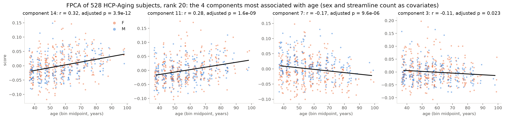
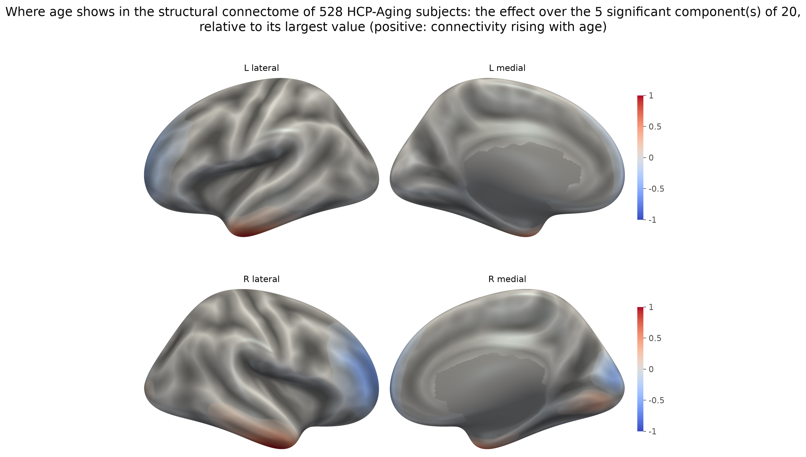

# sbci

Continuous brain connectivity: read, parcellate, smooth, couple, align and
reduce surface-based continuous connectomes on the ico4 grid (5124 vertices),
with every method a verified port of the SBCI group's MATLAB.

> **Status: pre-alpha.** Every method in the API table below is implemented
> and verified against its reference; only `sbci download` waits on the data
> release.

## Install

Python 3.10 or newer. The package is not on PyPI yet, so install from GitHub:

```bash
pip install "sbci @ git+https://github.com/xya2001/SBCI.git"             # core: numpy, scipy, h5py, nibabel
pip install "sbci[plotting] @ git+https://github.com/xya2001/SBCI.git"   # adds matplotlib and nilearn for figures
```

On UNC's Longleaf cluster use `scripts/setup_longleaf.sh` instead; see
*Development on Longleaf* below.

## Try it in two minutes

One real subject is 96 MB away: the example cohort (ten HCP-Aging subjects)
is fetched by the package, and everything below runs on the first of them.

```python
import sbci
from sbci.download import fetch_cohort

sc_path, fc_path = fetch_cohort(out="hcp-aging", subjects=["sub-HCA6924080"])   # once; verified
sc = sbci.load(sc_path)                  # structural connectome with its 903,797 endpoints
sc.to_atlas("Schaefer200").shape        # (200, 200)
sc.plot(sc.seed(vertex=1234))            # a figure; needs the plotting extra
sc.smooth(kernel="shk", mask_medial_wall=True)     # re-smooths from the stored endpoints
sc.coupling(sbci.load(fc_path))          # structure-function coupling, one value per vertex
```

Or from the shell:

```bash
sbci download hcp-aging --subject sub-HCA6924080   # the two files, into ./hcp-aging
sbci info hcp-aging/sub-HCA6924080_sc.h5           # what it holds
sbci validate hcp-aging/sub-HCA6924080_sc.h5       # nine checks, all should pass
sbci atlases --match Yeo                           # the bundled atlases
```

`sbci.example()` still builds a synthetic connectome on the real grid, for the
tests and for a machine without network access; nothing in this README is
drawn from it.

The figures in this README are drawn
from ten HCP-Aging subjects, 38 to 83 years old, converted from the lab's
pipeline output with `tools/build_hcp_cohort.py` and drawn on FreeSurfer's
fsaverage surface, rendered with smooth lighting through PyVista
(`plot(mesh="fsaverage", engine="pyvista")`); `scripts/hcp_figures.py`
regenerates them, and [docs/figures](docs/figures/README.md) describes each.


*`cc.plot(cc.seed(vertex=1234), mesh="fsaverage")`: where one vertex of one
subject connects to. The value at each vertex is the density of streamlines
between the seed (the orange dot, left temporal cortex) and that vertex,
relative to the strongest, on the inflated surface shaded by sulcal depth.*

**What smoothing does.** Tractography gives endpoints. One subject's 903,797
streamlines were split into two random halves; 576 of them touch vertex 1234
in one half and 569 in the other. With this many streamlines a single vertex
is already well sampled, so the two halves' raw counts agree across the
cortex at r = 0.96; once smoothed they agree at r = 1.00, and each half's
map matches the map from all streamlines at r = 0.98. With fewer streamlines
the raw counts of two halves share less and smoothing matters more; either
way, smoothing is what makes two subjects, or two sessions, comparable vertex
by vertex.


*Top: the far ends of the streamlines that touch the vertex (blue dots), in
the two halves and in the whole set. Bottom: the smoothed density of the same
vertex from each, relative to its strongest vertex.*

## With real data

```python
import sbci

cc = sbci.load("sub-100307_sc.h5")     # a computational file from the pipeline, or from tools/import_legacy.py
M  = cc.to_atlas("Schaefer200")        # 200 x 200 matrix
p  = cc.seed(vertex=1234)              # profile on the surface
cc.plot(p)                             # inflated-surface figure
cc.to_cifti("sub-100307_sc.dconn.nii") # opens in Workbench; 16.9 GB
```

The example cohort, the ten HCP-Aging subjects the figures are drawn from, is
hosted on a public Google Drive ([the folder](https://drive.google.com/drive/folders/1cC4vvF8XqixaRr6X1tJ6FsraDVArsQAP), for browsing) and
fetched by the package:

```bash
sbci download hcp-aging                          # all ten subjects, SC and FC, about 1 GB
sbci download hcp-aging --subject sub-HCA6924080 --sc-only   # one 56 MB file
```

Each file is verified against the SHA-256 in the package's manifest
(`src/sbci/data/hcp_aging.json`, which also gives each subject's sex and
five-year age bin), and a re-run skips what is already present. The full
cohort, every HCP-Aging subject with complete pipeline output, is a second
cohort on Zenodo: `sbci download hcp-aging-full` (46 GB in zip bundles of
twenty-four subjects per modality; `--subject` fetches just the bundles a
subject needs). The SC files
carry the streamline endpoints, so `smooth()` and `endpoints_align()` run on
them; `scripts/hcp_figures.py hcp-aging docs/figures` regenerates every figure
from the download. Existing pipeline output converts with
`tools/import_legacy.py` (see *Using legacy pipeline output*). Running the
lines above on a machine none of us configured, from a blank environment, in
under five minutes is the acceptance criterion for this package; it is
encoded in `tests/test_five_minute_start.py`, which runs against the first
subject when `SBCI_DOWNLOAD=1` or `SBCI_HCP_DIR` is set and skips otherwise.

## The documents

| Read | For |
| --- | --- |
| [USAGE.md](USAGE.md) | every working function with a worked example, and what each error tells you |
| [BLUEPRINT.md](BLUEPRINT.md) | what the package is, what "finished" means, where it stands, and the decisions it waits on |
| [PORTING.md](PORTING.md) | how each of the seven MATLAB methods was ported and verified, and the errors found in the references |
| [SPEC_QUESTIONS.md](SPEC_QUESTIONS.md) | the file-format decisions, answered and open |
| [VERIFICATION.md](VERIFICATION.md) | how to check every claim yourself, in tiers from five minutes to a MATLAB licence |
| [scripts/](scripts/README.md), [tools/](tools/README.md) | worked scripts (with the lab's Longleaf paths) and the builders of the bundled data |

## API

| Call | Status |
| --- | --- |
| `sbci.load(path)` | implemented; the `.h5` computational file, validated on read. The `.dconn.nii` exchange file is write-only: its resampling to fsLR-32k is many-to-one |
| `ContinuousConnectome.load(path)` | the same thing, if you prefer the class |
| `.save(path)` | implemented |
| `.to_atlas(atlas, how="mass"\|"mean")` | implemented; takes an `Atlas` or a name such as `"Schaefer200"`; matches `parcellate_sc.m` to float64 rounding |
| `.seed(vertex=...)` / `.seed(region=...)` | implemented; `region=` takes a vertex mask or an `(atlas, region)` pair |
| `.coupling(fc, scope=...)` | implemented; matches the MATLAB to float64 rounding |
| `.plot(values, surface=...)` | implemented; inflated, white, pial and sphere bundled |
| `.to_cifti(path)` | implemented; fsLR-32k dense connectome, 16.9 GB |
| `sbci validate <file>` | implemented |
| `.smooth(kernel=..., bandwidth=..., eigenpairs=...)` | implemented for all three kernels. `shk` is the default and reproduces `concon` at r = 1.000000 across five subjects; `rdk` matches MATLAB to 3.25 float32-eps, `matern` is checked against its closed form (no MATLAB reference exists), and both find the Laplace-Beltrami basis via `$SBCI_LBO_DIR` (PORTING.md items 1 and 6) |
| `sbci download hcp-aging` / `sbci.download.fetch_cohort` | implemented; fetches the ten-subject example cohort from its public Google Drive and verifies every file against the manifest |
| `sbci.migrate_warp(warp, to="fs_LR_32k")` | implemented; restates an ENCORE or ConSEAL warp on fs_LR (MSMAll's sphere) or full-resolution fsaverage and writes it as a deformed sphere, so that Workbench can resample a subject's MSMAll fMRI or myelin map through the warp found from its connectivity (USAGE.md has the example) |
| `.reduce(rank=K)` / `sbci.reduce(cc_list, rank=K)` | implemented; matches the MATLAB reference to float64 rounding (PORTING.md item 5) |
| `sbci.align(cc_list, template=None)` | implemented; ENCORE. Registers every connectome onto one template: with no `template=` it first estimates one, the Karcher median of the cohort's square-root densities, so that no subject is the reference (the default for a cohort); with `template=` a square-root density (an earlier run's `result.template`, or one subject's) it registers onto that instead, which is how a new subject joins a cohort or one subject is registered onto another. Geometry and template match MATLAB to float64 rounding, the registration to r = 0.99999979 (PORTING.md item 4) |
| `sbci.endpoints_align(cc_list, template=None)` | implemented; ConSEAL, which warps the streamline endpoints themselves, used the same way: no `template=` estimates the Karcher median first and registers everyone onto it; `template=k` registers everyone onto subject `k`, which stays put; a square-root density registers onto that. Every stage matches the public MATLAB to the single precision it carries; four errors in that reference are corrected by default and reproducible with `strict_upstream=True` (PORTING.md item 7) |
| `sbci.stats.local_test(scores, design)` | implemented; **no reference exists**, so verified against `scipy.stats` and against the procedures' own guarantees (PORTING.md item 5) |
| `sbci.example(modality="sc"\|"fc")` | implemented; a synthetic connectome on the real grid with 20,000 synthetic endpoints, for the tests and for a machine without network access; the documentation's examples use the released subjects instead |
| `sbci.example_cohort(n_subjects, seed, effect)` | implemented; a synthetic cohort with one bundle scaled by a synthetic age, with which `reduce`, `local_test` and the alignments are checked against a planted answer (PORTING.md items 5 and 7) |
| `sbci info <file>` | implemented; what a file holds, without opening Python |
| `sbci example --out <file>` | implemented; writes a file to try the package on |
| `sbci atlases [--match ...]` | implemented; lists the bundled atlases and their region counts |

## An end-to-end analysis

The single-subject methods need one subject; the cohort methods need a
cohort. The ten example subjects are enough to align (below), but not to ask
a question of: an age effect among ten people is out of reach. The full
HCP-Aging cohort, all 528 subjects with complete pipeline output, is being
released on Zenodo as `sbci download hcp-aging-full` (46 GB in zip bundles;
until the record is published the command says so), for association studies
such as this one:

```python
import csv
import numpy as np
import sbci
from sbci.download import fetch_cohort

paths = fetch_cohort(out="hcp-aging-full", cohort="hcp-aging-full", modalities=("sc",))
rows = list(csv.DictReader(open("hcp-aging-full/manifest.csv")))   # subject, sex, age_bin
subjects = [sbci.load(p) for p in paths]
age = np.array([np.mean([int(v) for v in r["age_bin"].split("-")]) for r in rows])
female = np.array([r["sex"] == "F" for r in rows], dtype=float)
count = np.array([s.metadata.get("streamline_count") for s in subjects]) / 1e6
reduction = sbci.reduce(subjects, rank=20)                 # FPCA: a batch job, 160 GB, four hours on one core
design = np.column_stack([age, female, count])             # age, and sex and streamline count as nuisance
result = sbci.local_test(reduction.scores, design, terms=[1])
result.significant()
effect = result.effect_map(reduction, alpha=0.05)          # one value per vertex, significant components only
subjects[0].plot(effect, mesh="fsaverage", engine="pyvista")
```

On the 528 subjects, five of the twenty components track age after the
false-discovery-rate correction across them, with sex and the streamline
count in the model. The two strongest, components 14 and 11, correlate with
age at r = 0.32 and 0.28 (adjusted p 4e-12 and 2e-9). The effect map says
where: connectivity falls with age at the frontal poles and in rostral middle
frontal cortex, and rises in inferior temporal cortex and at the temporal
poles; the densities have unit mass, so a rise is relative to the rest of the
connectome.

Two choices make this work, and a first try without them found nothing. A
rank-4 fit has no component that tracks age (the largest correlation is
-0.11), because the largest differences between these subjects are not age:
they follow how many streamlines tractography produced, 0.5 to 1.8 million
per subject. At the level of Desikan regions the count is the first direction
of variation across subjects and age the second, while half of all region
pairs change significantly with age. Twenty components reach past the count,
and the count belongs in the design as a nuisance covariate. PORTING.md item
5 has the measurements.



*The four components of a rank-20 FPCA of 528 HCP-Aging subjects most
associated with age, given sex and streamline count: each subject's score
against its age bin's midpoint, women orange and men blue, with the
least-squares line and the adjusted p-value.*



*The effect map over the five significant components, relative to its
largest value: the fitted change in connectivity with age, summed over the
other endpoint.*

Alignment fits in front of `reduce`: `sbci.align(subjects)` (ENCORE) returns
the warped densities as `aligned`, and `sbci.endpoints_align(subjects)`
(ConSEAL) warps every subject's endpoints onto a common template,
`aligned_endpoints(i)` hands them back, and `smooth()` turns them into aligned
connectomes (USAGE.md shows the three lines). Timings are for four cores.

**Alignment, with a known answer.** One HCP-Aging subject's 903,797
endpoints were moved by a known smooth warp, a random field of spherical
harmonic degree up to four, 1.7 degrees on average and 4 at most, and the
deformed copy was registered back onto the undeformed subject, both through
the package's smoother. ENCORE, searching its default degree-6 basis, undoes
87% of the displacement in eight steps: the endpoints come back from 1.66 to
0.21 degrees, the cost falls to 0.18 of its start, and the warp it finds
agrees with the true field at cosine 0.96. ConSEAL, with the paper's update
rule and a stopping threshold of 1e-7, brings them to within 0.10 degrees, 94%, in sixty iterations. The figure
shows, vertex by vertex, how far the endpoints still are from where they
started. An earlier version of this test had ENCORE undoing almost nothing,
for two reasons PORTING.md item 4 measures: the reference was the pipeline's
stored density, which sits further from its own re-smoothed endpoints than
the warp moves anything, and the warp had structure at the grid scale, which
a smoothed density cannot see.


**Carrying the warp to another template.** The warp ENCORE found on the grid is an anatomical correspondence, and it applies to anything of the same subject on another sphere. The same known warp was applied to the subject's own resting-state map of the seed at fsaverage resolution (163,842 vertices per hemisphere, from the pipeline's time series): it moved the map to a correlation of 0.87 with the original. ENCORE's warp, estimated from connectivity on 5,124 vertices and restated on fsaverage by `sbci.migrate_warp`, put the map back to 0.99, and on fsaverage it sits 0.35 degrees from the true warp (which moved vertices 1.58 degrees on average).


**Alignment and the analysis.** What aligning first does to an association
is measured against a planted answer in PORTING.md items 5 and 7: with the
cohort's anatomy jittered by three degrees the planted effect slips past a
rank-4 FPCA's default start, `candidates=6` reaches it, ENCORE puts it first,
and ConSEAL keeps it with its default regularization or a mean template.

**Aligning the ten subjects.** Registered onto a template estimated from the
cohort, with every density from the package's smoother, the subjects grow
more alike: the mean correlation between two subjects' connectomes rises from
0.704 to 0.758 after ten ENCORE iterations and to 0.780 after thirty
ConSEAL iterations, and the cost falls for every subject. ENCORE registers onto its Karcher median, which stayed clear of
every subject. ConSEAL's median settled on one of the ten subjects (0.001
degrees from it, 25 to 31 from the others), which would have registered the
other nine onto that subject's connectome, so the figure registers onto the
mean of the square-root densities instead; onto the one subject the mean
correlation comes out a little higher, for the wrong reason. The USAGE
notes explain when the median does this and how to pass a template. Ten
subjects at roughly 800,000 streamlines each take five minutes with ENCORE
and an hour with ConSEAL on four cores.


*Left: each subject's registration cost per iteration, relative to its start,
for ENCORE and ConSEAL. Right: the correlation between the connectomes of
each of the 45 pairs of subjects before alignment and after each method, with
the mean.*

## Getting around the package

Everything public is reachable straight off `sbci`, and so is every submodule,
so `import sbci` is all the import line anyone needs:

```python
import sbci

sbci.load, sbci.smooth, sbci.align, sbci.reduce, sbci.local_test
sbci.stats.local_test          # submodules resolve too
```

The heavier submodules load on first use, so `import sbci` costs about 300 ms
and pulls in neither matplotlib nor scipy unless you touch something that
needs them. `tests/test_api_surface.py` pins the import set; the time is not asserted.

Anything wrong with a *file or its contents* raises a subclass of
`sbci.SbciError`, so one `except` covers a pipeline's input problems while a
mistake in your own arguments still raises a plain `ValueError`:

```python
try:
    cc = sbci.load(path)
except sbci.SbciError as exc:
    print(f"{path} is unusable: {exc}")
```

`SbciError` subclasses also derive from the built-in exception you would reach
for first -- `FormatError` is a `KeyError`, `MetadataError` is a `ValueError`
-- so existing code keeps working.

Names that do not exist suggest ones that do, rather than printing the whole
catalogue:

```python
>>> sbci.load_atlas("Shaefer200")
UnknownAtlasError: unknown atlas 'Shaefer200'. Did you mean 'Schaefer200'?
>>> sbci.load_atlas("Desikan").region_mask("LH_banksts")
ValueError: aparc has no region named 'LH_banksts'. Did you mean 'LH_bankssts'?
```

## Atlases

44 atlases ship inside the package (about 330 KB), so `to_atlas` needs no
network, no FreeSurfer and no MATLAB:

```python
from sbci import list_atlases, load_atlas

load_atlas("Schaefer200").n_regions   # 200
load_atlas("Desikan").n_regions       # 68
load_atlas("Glasser").n_regions       # 360
```

Short names (`Schaefer200`, `Desikan`, `DK`, `Destrieux`, `Glasser`,
`Brainnetome`, `Yeo7`, `Yeo17`) resolve to the stored names, ignoring case,
spaces, hyphens and underscores. `list_atlases()` gives the full set, which
also includes Gordon, the PALS-B12 family and CoCoNest at 22 scales.

Label `0` means "no region" -- the medial wall, plus everything outside a
partial-coverage atlas. Regions are numbered `1..K` with no gaps.

Regenerate them with `tools/convert_atlases.py` if the source ever changes;
the output is committed so no release step needs MATLAB.

## Using legacy pipeline output

`tools/import_legacy.py` converts existing SBCI `.mat` output into the HDF5
format, so a cohort processed with the old pipeline can be used today without
reprocessing:

```bash
python tools/import_legacy.py \
    --sc smoothed_sc_avg_0.005_ico4.mat \
    --fc fc_avg_ico4.mat \
    --mapping mapping_avg_ico4.npz \
    --subject 100307 --out derivatives/
sbci validate derivatives/sub-100307_sc.h5
```

Verified end to end on the SBCI_Toolkit example subject: both files pass every
validator check, `to_atlas(Schaefer200)` returns a 200x200 matrix retaining
99.98% of the connectome mass, and SC and FC correlate at r = 0.26 across the
19,900 region pairs.

## Development on Longleaf

Longleaf's default `python3` is 3.8, which this package does not support.

```bash
./scripts/setup_longleaf.sh                                   # once
module load python/3.12.4                                     # every session
source /work/users/${USER:0:1}/${USER:1:1}/$USER/sbci-venv/bin/activate   # the two letters are your onyen's first two
pytest
```

**Load the module before activating, every time.** The virtualenv's interpreter
is dynamically linked against the module's `libpython3.12.so.1.0`, which is not
on the default library path. Activating without loading the module gives:

```
python: error while loading shared libraries: libpython3.12.so.1.0:
cannot open shared object file: No such file or directory
```

That is a missing module, not a broken environment — `module load` fixes it
without recreating anything.

The virtualenv lives on `/work` rather than in `$HOME` because home quotas are
50 GB and a scientific-Python environment is several hundred megabytes. `/work`
is scratch and **is purged**, so the environment is disposable by design:
`scripts/setup_longleaf.sh` rebuilds it from nothing. Only this repository is
persistent, so anything worth keeping belongs in git.

`scripts/test.sbatch` runs the suite as a SLURM job:

```bash
sbatch scripts/test.sbatch
```

The suite takes about two minutes on four cores, which the login node tolerates. The batch script exists because the full-grid and
tutorial-subject tests will not be, once the data release lands, and those do
not belong on a login node.

## License

MIT -- see [LICENSE](LICENSE).
