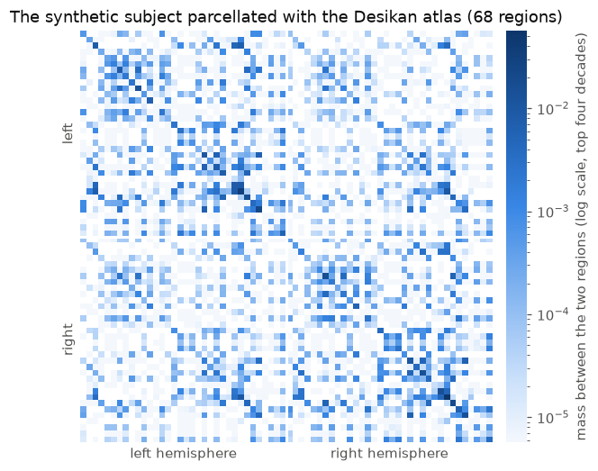
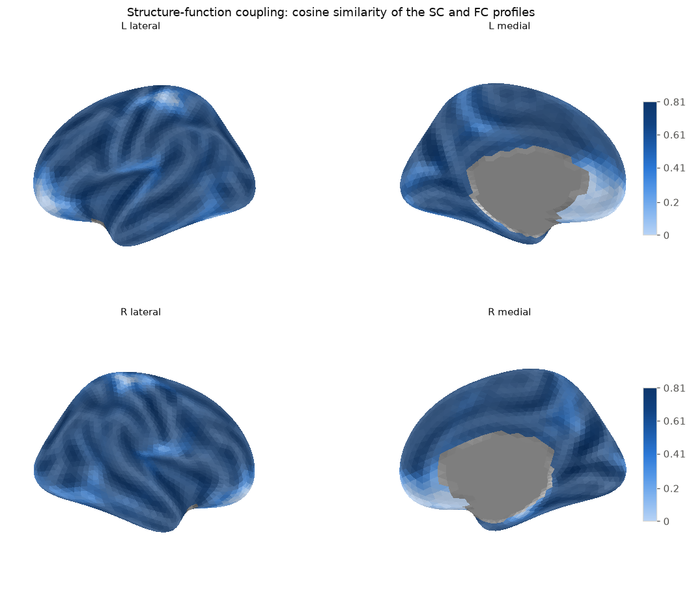
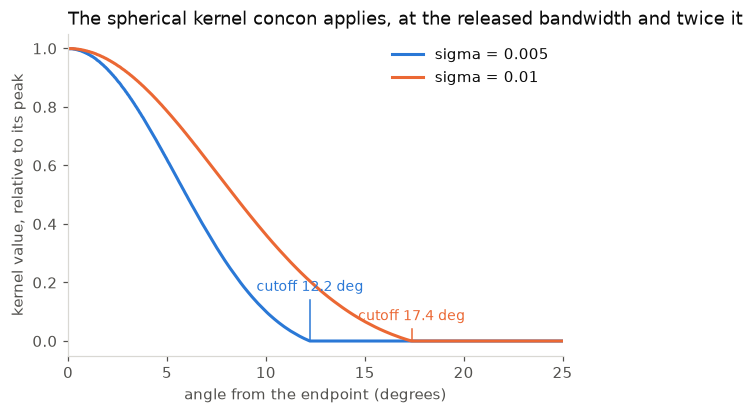
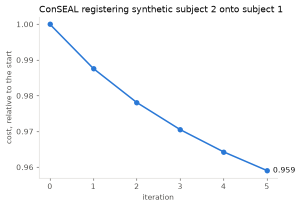

# Using the package

Everything below is live: `scripts/tour.py` runs all of it and prints the
output quoted here.

## Setup anywhere

```bash
pip install "sbci[plotting] @ git+https://github.com/xya2001/SBCI.git"
python -c "import sbci; print(sbci.example())"
```

Python 3.10 or newer; the plotting extra is only for figures. Without data of
your own, every example below runs on `sbci.example()` and
`sbci.example_cohort()`. The paths quoted are the lab's on the Longleaf
cluster, so substitute yours. The `rdk` and `matern` kernels need the
Laplace-Beltrami basis, two files from `SBCI_Toolkit/concon_estimate`; *Storing
endpoints, and re-smoothing from them* says where to put them.

## Setup on Longleaf

**Once:**

```bash
cd ~/sbci && ./scripts/setup_longleaf.sh
```

That loads the Python module, creates the virtualenv on `/work` and installs
the package in editable mode with its development extras.

**Every session:**

```bash
module load python/3.12.4
source /work/users/x/y/xya/sbci-venv/bin/activate
```

**Load the module before activating, every time.** The virtualenv's interpreter
is linked against the module's `libpython3.12.so.1.0`, which is not on the
default library path. Activating without loading gives

```
python: error while loading shared libraries: libpython3.12.so.1.0
```

That is a missing module, not a broken environment. `module load` fixes it
without recreating anything.

`/work` is scratch and is purged, so the environment is disposable by design —
`scripts/setup_longleaf.sh` rebuilds it from nothing. Only the repository is
permanent.

## Data to try it on

Anywhere, `sbci.example()` and `sbci.example_cohort()` build synthetic subjects
on the real grid. On Longleaf, one real subject is already imported, converted
from legacy pipeline output:

```
/work/users/x/y/xya/sbci-derivatives/sub-example_sc.h5
/work/users/x/y/xya/sbci-derivatives/sub-example_fc.h5
```

Both pass every validator check. To convert more, use
`tools/import_legacy.py`.

> Every path below is literal and copy-pasteable. If you see a
> `FileNotFoundError` mentioning `...`, an ellipsis placeholder was pasted as a
> real path.

## Loading

```python
from sbci import ContinuousConnectome

sc = ContinuousConnectome.load("/work/users/x/y/xya/sbci-derivatives/sub-example_sc.h5")
fc = ContinuousConnectome.load("/work/users/x/y/xya/sbci-derivatives/sub-example_fc.h5")
```

```
sc                ContinuousConnectome(modality='sc', n_vertices=5124)
stored form       (13122006,) float32, the strict upper triangle
area weights      (5124,), sum 327,684
cortex mask       4,685 of 5,124 vertices
```

Connectivity is held as the strict upper triangle in float32 — the form it
takes on disk — and expanded on demand with `.dense()`, which allocates about
105 MB. `load()` validates the metadata and **refuses a file missing any
required key**, rather than defaulting, because a silently defaulted bandwidth
makes two incomparable files look comparable.

Useful attributes: `.data`, `.area`, `.mask`, `.metadata`, `.modality`,
`.n_vertices`.

## Atlases

```python
from sbci import list_atlases, load_atlas

load_atlas("Desikan").n_regions        # 68
load_atlas("Schaefer200").n_regions    # 200
load_atlas("Glasser").n_regions        # 360
```

44 atlases ship inside the package (332 KB), so this needs no download, no
FreeSurfer and no MATLAB. Short names resolve to the stored names ignoring
case, spaces, hyphens and underscores. `list_atlases()` gives the full set,
which also includes Gordon, Yeo, the PALS-B12 family and CoCoNest at 22 scales.

Label `0` means "no region" — the medial wall, plus anything outside a
partial-coverage atlas. Regions are numbered `1..K` with no gaps, and
`atlas.names[i]` names label `i + 1`.

## `to_atlas` — vertex matrix to region matrix

```python
mass = sc.to_atlas(atlas, how="mass")   # (68, 68), sums to 1.000000
mean = sc.to_atlas(atlas, how="mean")   # (68, 68), a density
```

`"mass"` sums the area-weighted connectivity crossing each region pair, so the
total is preserved. `"mean"` divides that by the product of the two regions'
areas, giving a density comparable across regions of different size; this
reproduces `parcellate_sc.m`. FC is aggregated through Fisher-z automatically,
because averaging correlations directly is biased.



*`cc.to_atlas("Desikan")` on the synthetic subject: 68 regions, left hemisphere
first, mass on a log scale.*

## `seed` — one profile

```python
sc.seed(vertex=1234)      # (5124,) — that vertex's density slice
sc.seed(region=mask)      # (5124,) — a region's area-weighted marginal
```

`region=` takes a boolean mask over vertices, so
`atlas.labels == atlas.region_ids[10]` selects one region. The vertex form
reads its row without materializing the dense matrix.

## `coupling` — structure against function

```python
sc.coupling(fc, scope="global")                        # (5124,)
sc.coupling(fc, scope="region", labels=atlas.labels)   # (5124,)
```

```
global    4,683 finite, range [-0.106, 0.533], mean 0.248
region    mean 0.671
```

NaN marks the medial wall and any vertex whose profile is constant. Local
coupling runs higher than global because neighbouring vertices inside a region
share both structure and function.

Two things worth knowing: **negative FC values are kept** — discarding them
flips the sign of the map in association cortex — and **`discrete_coupling` is
a Pearson correlation, not a cosine**, matching MATLAB's `corr2`, while global
and region are uncentred cosine similarity.



*`sc.coupling(fc)` for the matching synthetic SC and FC: one cosine similarity
per vertex, drawn on the inflated surface.*

## `plot` — a surface figure

```python
import matplotlib
matplotlib.use("Agg")          # no display on a cluster node

figure = sc.plot(coupling_map, title="SC-FC coupling", cmap="coolwarm")
figure.savefig("coupling.png", dpi=150)
```

Four panels, each hemisphere seen laterally and medially, on a surface shaded
by sulcal depth so the folds show through the map, with the medial wall left
flat since it is a cut surface and not cortex (`shading=False` draws the bare
mesh; `threshold=` hides the small values so the shading shows there).
Needs the plotting extra, which `setup_longleaf.sh` installs. Four geometries
are bundled -- inflated (the default), white, pial and sphere -- all in the
grid's vertex order and sharing one face list (`SPEC_QUESTIONS.md` items 11
and 13).

## `save` and `sbci validate`

```python
sc.save("sub-copy_sc.h5")
```

```bash
sbci validate sub-copy_sc.h5
```

```
[PASS] readable    [PASS] metadata     [PASS] grid    [PASS] symmetry
[PASS] nonnegativity    [PASS] unit mass    [PASS] mask
```

Exit status 0 means every check passed. `save()` validates before writing, so a
run that forgot to record its bandwidth fails without leaving a partial file.

## The kernel maths, usable directly

`cc.smooth()` is the high-level route; the functions underneath are usable
directly:

```python
from sbci.smoothing import (
    Endpoints, diffusion_kernel, kappa_candidates, load_eigenpairs, smooth_endpoints,
)

lam, U = load_eigenpairs("/work/users/x/y/xya/sbci-reference/SBCI_Toolkit/concon_estimate/EV_LBO_ds_ico4_L.mat", "L")
kappa  = kappa_candidates(lam)[3]
K_L    = diffusion_kernel(lam, U, kappa)
lam_R, U_R = load_eigenpairs("/work/users/x/y/xya/sbci-reference/SBCI_Toolkit/concon_estimate/EV_LBO_ds_ico4_R.mat", "R")
K_R    = diffusion_kernel(lam_R, U_R, kappa)
density = smooth_endpoints(Endpoints.from_matlab(
    "/work/users/x/y/xya/sbci-reference/SBCI_Toolkit/example_data/SBCI_Individual_Subject_Outcome/mesh_intersections_ico4.mat"), K_L, K_R)
```

Verified against a MATLAB reference run to single-precision rounding, which is
all the reference itself carries. Takes 4.4 s for both hemispheres.



*The kernel `smooth(kernel="shk")` applies, relative to its peak, at the
released bandwidth and at twice it, with the cutoff beyond which it is zero.*

## Storing endpoints, and re-smoothing from them

A structural file can carry the streamline endpoints it was built from, in an
optional `/endpoints` group. Without them a connectome is a finished product;
with them it can be re-smoothed at another bandwidth or with another kernel.
`sbci.example()` carries 20,000 synthetic ones, so
`sbci.example().smooth(kernel="shk", mask_medial_wall=True)` runs anywhere and
gives the example back; the rest of this section is about real files.

```python
from sbci import ContinuousConnectome
from sbci.smoothing import Endpoints

TOOLKIT = "/work/users/x/y/xya/sbci-reference/SBCI_Toolkit"

sc = ContinuousConnectome.load("/work/users/x/y/xya/sbci-derivatives/sub-example_sc.h5")
sc.endpoints = Endpoints.from_matlab(
    f"{TOOLKIT}/example_data/SBCI_Individual_Subject_Outcome/mesh_intersections_ico4.mat"
)
sc.save("/work/users/x/y/xya/sub-example_desc-withendpoints_sc.h5")
```

On the example subject that is 383,760 streamlines and takes the file from
**20.0 MB to 31.8 MB**. The group is optional, so a file without it is still
valid -- it simply raises when you try to re-smooth.

```python
back = ContinuousConnectome.load("/work/users/x/y/xya/sub-example_desc-withendpoints_sc.h5")
back.has_endpoints                      # True
back.endpoints.n_streamlines            # 383760
back.endpoints.has_positions            # True: barycentric positions too

resmoothed = back.smooth(kernel="rdk", eigenpairs=f"{TOOLKIT}/concon_estimate")
resmoothed.metadata["kernel"]           # 'rdk'
resmoothed.metadata["bandwidth"]        # 1.948262, from the reference formula
```

Six seconds on a login node. The result is a new `ContinuousConnectome`
normalized to unit mass, carrying the same endpoints, so it can be re-smoothed
again at a different bandwidth.

**The Laplace-Beltrami basis** is `EV_LBO_ds_ico4_L.mat` and
`EV_LBO_ds_ico4_R.mat`. Pass the directory as `eigenpairs=`, or set it once and
forget it:

```bash
export SBCI_LBO_DIR=/work/users/x/y/xya/sbci-reference/SBCI_Toolkit/concon_estimate
```

`.smooth()` also looks in `$SBCI_TOOLKIT/concon_estimate`, `~/.cache/sbci/lbo`
and `~/.sbci/lbo`, and names every one of them if it finds nothing. The files
are 50 MB per hemisphere and describe the grid rather than the subject, so they
are neither bundled in the wheel nor duplicated into every file. Recomputing
them from the bundled white surface was tried and is not good enough -- it
reproduces the reference kernel only to r = 0.94.

**Is it correct?** `smooth(kernel="rdk")` reproduces MATLAB's
`reference_density.mat` to **3.25 float32-eps**, correlation
0.999999999999921, and the bandwidth you get by passing nothing is the one the
reference run used to within 5e-08. Both are asserted in
`tests/test_matlab_reference.py`.

`kernel="shk"`, the default, reproduces `c3_main` at **r = 1.000000** across
five ADNI subjects, with the scale factor at 1.000000 and nothing fitted
(0.99858 with the closed-form series, `quantized=False`). The kernel is not
the heat kernel its name suggests: `concon` compounds a `(2l+1)` weight with a
normalized spherical harmonic, giving `(2l+1)^(3/2)`, and it has compact
support at about `2.9*sqrt(sigma)` radians. The 0.14% amplitude offset the
closed form carried was the binary's lookup-table quantization, and the tables
are now reproduced; what remains is 0.071% more non-zero pairs, where one ULP
in a dot product moves a vertex across the kernel cutoff (PORTING.md item 6). A full subject takes about a
minute. See PORTING.md item 6.

A re-smoothed density can carry mass on the medial wall, exactly as both
references do, so `sbci validate` may flag a file saved straight from it --
SPEC_QUESTIONS.md item 14. Pass `mask_medial_wall=True` to zero it first --
a file saved that way passes all seven `sbci validate` checks, verified end to
end on a real subject -- and `progress=lambda done, total: ...` to watch a run.

The kernel is evaluated the way `c3_main` evaluates it: through two
truncation-indexed lookup tables (10^5 harmonic samples, 10^6 kernel samples),
which is what removed the last 0.14% amplitude offset against the released
files. `spherical_heat_kernel(..., quantized=False)` gives the closed-form
series the tables approximate. Only the ~31 vertices inside the 12.2-degree
cutoff are visited per endpoint, found with a KD-tree.

## A synthetic cohort, end to end

`sbci.example()` gives one subject; `sbci.example_cohort()` gives a cohort
built to be analysed. The shared structure comes from `seed`: 48 bundle
centres on cortex (mirrored into the right hemisphere) and their base weights.
Each subject then multiplies the weights by a log-normal factor (spread 0.10),
moves the centres by a smooth random tangent field (about a degree), and draws
its own 20,000 streamlines. One bundle of median weight is scaled by
`1 + effect * z`, with `z` the subject's age standardized to `[-1, 1]` and
`effect=0.7` by default, so the oldest subject carries about six times the
youngest's weight on it. `variation=` and `anatomy=` set the two spreads. The returned `Cohort` holds the `connectomes`, the
`age` covariate, the `effect_bundle` index and `truth`, the planted bundle's
field over the surface.

```python
import sbci

cohort = sbci.example_cohort(n_subjects=10, seed=0)     # about 20 s on four cores

# optional: align first (ConSEAL warps the endpoints; re-smooth to get connectomes back).
# About two minutes per subject per five iterations on four cores: a batch job for a real cohort.
aligned = sbci.endpoints_align(cohort.connectomes, max_iterations=10)
for i, cc in enumerate(cohort.connectomes):
    cc.endpoints = aligned.aligned_endpoints(i)
subjects = [cc.smooth(kernel="shk", mask_medial_wall=True) for cc in cohort.connectomes]

reduction = sbci.reduce(subjects, rank=4)                # FPCA, one to three minutes depending on the node
result = sbci.local_test(reduction.scores, cohort.age)   # F test per component, FDR across them
result.significant()                                     # one component tracks age (its index varies run to run)
effect = result.effect_map(reduction, alpha=0.05)        # one value per vertex, significant components only
float(np.corrcoef(effect, cohort.truth)[0, 1])           # about 0.94: the planted bundle, where it was planted
subjects[0].plot(effect)
```

The planted effect is one source of variance among the individual variation,
not the largest: on our runs it was one of four components (the index varies
with the solver's start), its scores correlated with age at 0.95 and its
adjusted p-value was 1e-4. Make the cohort
harder and the analysis has to earn it -- `effect=0.5` slips past a rank-4
FPCA of ten subjects, and `anatomy=0.05` (three degrees of jitter) hides even
the default, which is exactly the situation alignment is for. Ten subjects
occupy about 520 MB as connectomes and four times that inside `reduce`.
`modality="fc"` builds the matching functional cohort
from the same bundles and weights, for coupling analyses across subjects.
Every file says `synthetic-cohort` in its `pipeline_version`.

## Reducing a cohort to a handful of numbers

A connectome is thirteen million numbers. FPCA finds a small set of surface
functions shared across the cohort, so each subject becomes a short score
vector suitable for regression or classification.

```python
import sbci
from sbci import ContinuousConnectome

subjects = [ContinuousConnectome.load(p) for p in paths]
result = sbci.reduce(subjects, rank=20)

result.basis            # (5124, 20)  the shared functions
result.scores           # (n_subjects, 20)  one row per subject
result.explained[-1]    # fraction of the cohort's norm captured
result.reconstruct(0)   # subject 1 rebuilt from its 20 numbers
```

Score new subjects against an existing basis with
`sbci.reduction.project(result, matrices)`, which is how a test-retest or
held-out set is handled. A single connectome is allowed and gives its own
rank-K separable approximation:

```python
sc.reduce(rank=10)
```

Two things to know:

- **`alpha` is a roughness penalty with a turning point.** Components are
  chosen by largest *magnitude* eigenvalue and the penalty enters negatively,
  so once it outweighs the data the fit returns the *roughest* direction
  instead of the smoothest and explains almost nothing. The default of `1e-10`
  is far below that; if you raise it, check `explained` has not collapsed.
- **This is a batch job on the full grid.** Each component involves several
  5124 x 5124 products; budget tens of GB and start with a small `rank` and
  `max_outer`.

## Testing scores against a covariate

```python
import sbci

result = sbci.reduce(subjects, rank=20)
test = sbci.stats.local_test(result.scores, age)

test.significant(0.05)            # which components carry an association
test.adjusted                     # Benjamini-Hochberg p-values
test.effect_map(result, alpha=0.05)   # where on the cortex the effect sits
```

Pass `method="bonferroni"` for family-wise control, or `permutations=5000` to
drop the Gaussian assumption. `effect_map` pushes the fitted coefficients back
through the basis and sums over one endpoint, giving one value per vertex --
it describes where the fitted effect lives; the p-values belong to the
components, not to individual vertices.

**Read this one more sceptically than the rest.** Every other function here is
checked against a MATLAB run of the original. There is no reference
implementation for local inference -- the FPCA repository contains none -- so
the choice of test is mine. It is verified against `scipy.stats` and against
the properties the procedures are defined by, but it has not been blessed by
anyone who wrote the method. See PORTING.md item 5.

## Aligning a cohort

ENCORE warps each subject's two spherical surfaces so that their connectivity
profiles line up, then reports the template and the per-subject warps.

```python
import sbci
from sbci import ContinuousConnectome

subjects = [ContinuousConnectome.load(p) for p in paths]
result = sbci.align(subjects, order=6, max_iterations=50)

result.template          # the Karcher median, as a square-root density
result.aligned[0]        # subject 1 warped onto it
result.costs             # final cost per subject
result.warps[0].save("sub-001_warp.npz")
```

**This is a batch job.** On the ico4 grid each iteration multiplies 5124 x 5124
matrices several times over; budget tens of GB of memory and hours for a
cohort, and start with a small `max_iterations` to see the cost falling.

Two things to know before trusting the numbers:

- **The bundled grid is rotated first.** The Jacobian is built in `(theta, phi)`
  coordinates and closes with a factor of `sin(theta)`, so a vertex on the
  coordinate axis gets a Jacobian of exactly zero and loses its whole row and
  column. The ico4 grid has four such vertices, so `align()` rotates the mesh
  clear of them -- a change of coordinates and nothing else. It refuses a grid
  you supply yourself that still has poles.
- **`delta` defaults to 1e-5, not the reference's 1e-10.** A central difference
  at 1e-10 loses six of sixteen digits; the reference's own derivative moves by
  2% of its range between adjacent step sizes. Pass `delta=1e-10` to reproduce
  the reference's conditioning exactly. PORTING.md item 4 has the measurements.

## Aligning by endpoints (ConSEAL)
ENCORE moves a smoothed density. ConSEAL moves the streamline endpoints
themselves: each endpoint rides along with the warped triangle it fell in, the
density is re-smoothed from where the endpoints now sit, and nothing is ever
resampled. It needs files that store the endpoints with their barycentric
positions (`cc.endpoints.has_positions`), which the pipeline's
`mesh_intersections_ico4.mat` provides.
```python
import sbci
subjects = [sbci.load(p) for p in paths]
result = sbci.endpoints_align(subjects)        # the public code's defaults
result.template                               # Karcher median, a square-root density
result.costs[0]                               # the cost trace of subject 1
result.warps[0].save("sub-001_conseal_warp.npz")
aligned = result.aligned_endpoints(0)         # an Endpoints object: re-smooth it, count it
```
Without lab data, two synthetic subjects will do:
`sbci.endpoints_align([sbci.example(seed=0), sbci.example(seed=1)], max_iterations=5)`
takes about a minute on four cores, and both costs fall at every step.
**This is a batch job too**, though a lighter one: the heat kernel at the
published bandwidth has 89 nonzeros per row on ico4, so an iteration costs
seconds per 100,000 streamlines rather than minutes. Three things to know:
- **The defaults are the public code's, not the paper's.** Step 0.05, up to
  100 iterations, threshold 1e-4, a 0.2 clamp on the largest displacement and
  5% Laplacian smoothing of the velocity field every step. The paper's own
  experiments were run from a fork without the clamp and smoothing, at step 0.1
  and threshold 1e-6; `viscosity=0, step_clamp=float("inf"), delta=0.1,
  threshold=1e-6` gives that update rule. PORTING.md item 7 explains the
  lineage.
- **Four errors in the reference are corrected by default.** Its gradient adds
  a term in the wrong tangent frame and differentiates a differently
  normalized kernel; a refused warp step still enters its velocity field; and
  a rising cost is accepted as convergence. `strict_upstream=True` reproduces
  all four, and does so to the digits of the MATLAB reference run.
- **Rigid initialization is off by default**, as in the reference's own
  example; `init_rotation=True` runs the multi-shell rotation search first.


*`sbci.endpoints_align` registering one synthetic subject onto another for five
iterations: the cost falls at every step.*

## Writing the exchange file

```python
from sbci import ContinuousConnectome

sc = ContinuousConnectome.load("/work/users/x/y/xya/sbci-derivatives/sub-example_sc.h5")
sc.to_cifti("/work/users/x/y/xya/sub-example_sc.dconn.nii")
```

Three files are written: the dense connectome, a `.json` sidecar with the
metadata table, and a `_vertexarea.dscalar.nii` of fsLR vertex areas. The
connectome holds a density, so anything that integrates it -- parcellation,
totals, region means -- needs those areas; they are not recoverable from the
`.dconn` alone.

**This does not belong on a login node.** The output is 64,984 x 64,984 in
float32, **16.9 GB on disk**, and the writer needs about 25 GB of memory and
three minutes. Use a batch job:

```bash
sbatch --mem=60G --time=01:00:00 --wrap="module load python/3.12.4; source /work/users/x/y/xya/sbci-venv/bin/activate; python scripts/write_exchange_file.py"
```

To read it back, use plain `nibabel` -- the package deliberately does not
provide the inverse, because 5,124 values cannot be recovered from 64,984 and
a silent round trip would degrade the data:

```python
import nibabel as nib, numpy as np

img = nib.load("/work/users/x/y/xya/sub-example_sc.dconn.nii")
axis = img.header.get_axis(0)          # BrainModelAxis, 64,984 elements
row = np.asarray(img.dataobj[1234])    # one vertex's profile, memory-mapped
```

Slice `img.dataobj` rather than calling `get_fdata()`, which would pull all
16.9 GB into memory at once.

### Checking it with Connectome Workbench

Workbench is the reference reader for this format, and it is already on
Longleaf. Use **1.5.0** -- the 2.0.1 build on this cluster is missing
`libglapi.so.0` and will not start.

```bash
module load connectome/1.5.0
wb_command -file-information /work/users/x/y/xya/sbci-derivatives/sub-example_space-fsLR_den-32k_desc-concon_sc.dconn.nii
```

On the example subject this reports `Type: CIFTI - Dense`, `Structure:
CortexLeft CortexRight`, 64984 x 64984, and `32492 out of 32492 vertices` for
each hemisphere -- so Workbench's own reader agrees with the header the writer
produced. The phrase "out of" is worth noting: it is Workbench saying the file
covers every vertex of the mesh including the medial wall, rather than the
59,412 cortical grayordinates HCP files usually carry. That is the convention
still open for ratification in SPEC_QUESTIONS.md item 4.

`wb_view` is the graphical browser, but it needs a display; from Longleaf that
means an OnDemand desktop session rather than a plain `ssh`.

## What raises, and what it tells you

| Call | Raises | Because |
| --- | --- | --- |
| `sc.smooth()` on a file with no `/endpoints` | `MissingDataError` | nothing to re-smooth from; the group is optional |
| `sc.smooth()` on endpoints stored as vertices only | `MissingDataError` | `shk` needs where each streamline crossed, not the nearest vertex |
| `sbci download` | `SystemExit` | needs the data release (Q6) |

Every message names what has to happen and where it is tracked.
