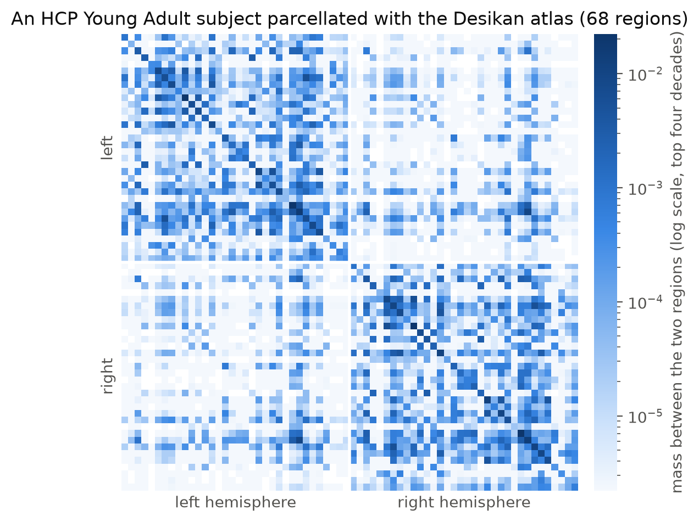
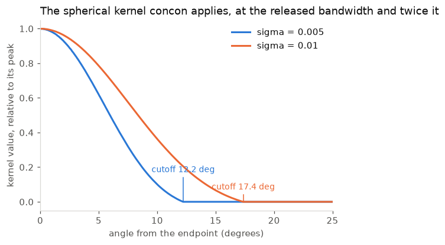
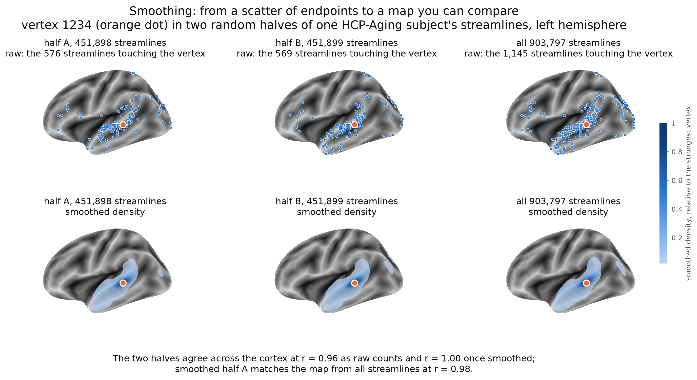
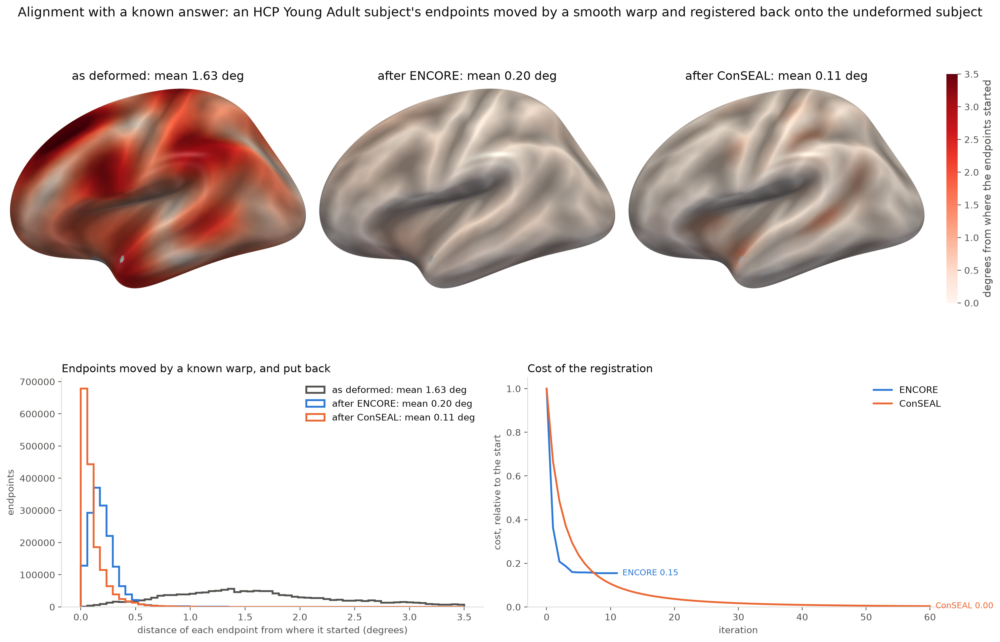
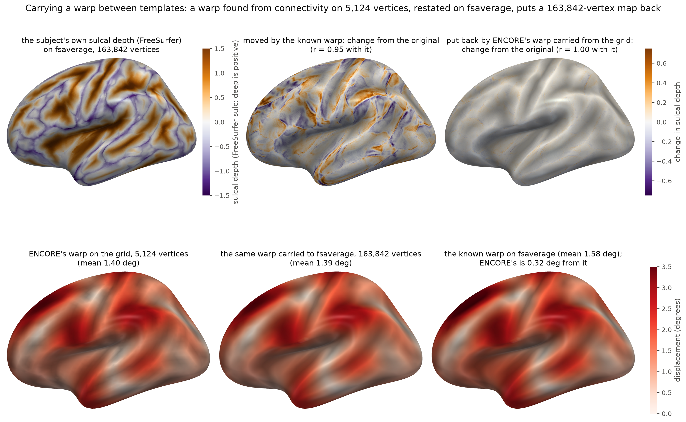

# Using the package

Everything below is live. `scripts/tour.py` runs the single-subject sections,
*Loading* through *The kernel maths*, and prints the output quoted there; the
cohort sections quote batch jobs whose output PORTING.md records, and the
sections on test-retest and prediction quote the notebooks in `notebooks/`,
saved with their outputs.

## Setup anywhere

```bash
pip install "sbci[plotting] @ git+https://github.com/xya2001/SBCI.git"
sbci download hcp-ya --subject 100307     # one real subject's SC and FC, 90 MB, into the current directory
```

Python 3.10 or newer; the plotting extra is only for figures. Every example
below runs on the released HCP Young Adult subjects: `sbci download hcp-ya
--out hcp-ya` fetches all eleven, their SC and FC (about 1 GB), and
`--subject` one of them. The paths quoted are the lab's copies on the
Longleaf cluster, so substitute yours. The `rdk` and `matern` kernels need the
Laplace-Beltrami basis, two files (`EV_LBO_ds_ico4_{L,R}.mat`) from
[SBCI_Toolkit](https://github.com/sbci-brain/SBCI_Toolkit)'s `concon_estimate`;
*Storing endpoints, and re-smoothing from them* says where to put them.

## Setup on Longleaf

**Once:**

```bash
cd ~/sbci && ./scripts/setup_longleaf.sh
```

That loads the Python module, creates the virtualenv on `/work` and installs
the package in editable mode with its development extras.

**Every session:**

```bash
module load python/3.12.4
source /work/users/x/y/xya/sbci-venv/bin/activate
```

**Load the module before activating, every time.** The virtualenv's interpreter
is linked against the module's `libpython3.12.so.1.0`, which is not on the
default library path. Activating without loading gives

```
python: error while loading shared libraries: libpython3.12.so.1.0
```

That is a missing module, not a broken environment. `module load` fixes it
without recreating anything.

`/work` is scratch and is purged, so the environment is disposable by design —
`scripts/setup_longleaf.sh` rebuilds it from nothing. Only the repository is
permanent.

## Data to try it on

The released cohort is described under *Getting the example cohort* below.
On Longleaf the lab's copy of the download is already there:

```
/work/users/x/y/xya/hcp-ya/data/sub-100307_sc.h5     # and the other ten, with manifest.csv
```

Every file passes every validator check. To convert other pipeline output,
use `tools/import_legacy.py`.

> Paths under `/work/users/x/y/xya/`, `/overflow/zzhanglab/` and `/proj/STOR/`
> are the lab's copies on Longleaf, to be substituted; everything else is
> literal and copy-pasteable.

## Getting the example cohort

Eleven HCP Young Adult subjects, each as an SC file that carries its
streamline endpoints and an FC file from the HCP's resting state: sub-100307,
the subject the package brief's acceptance
test names, and ten drawn at random, five women and five men, from the 946
with complete pipeline output in the lab's copy. They were rebuilt on the ico4 grid from
the SBCI pipeline's output by `tools/build_hcp_cohort.py` and are hosted
on a public Google Drive ([the
folder](https://drive.google.com/drive/folders/1gG2ZmxxVm4w5dvlCQvMaEEOBypU7nDpx)).
The FC comes from the HCP's cleaned resting-state runs, through
`tools/build_hcp_fc.py` (*Functional connectivity from the HCP's resting
state*, below). The package ships the manifest, not the data:

```bash
sbci download hcp-ya --out hcp-ya                    # the eleven subjects' SC and FC into ./hcp-ya, about 1 GB
sbci download hcp-ya --subject 100307                # sub-100307_sc.h5 and _fc.h5, into the current directory
sbci download hcp-ya --sc-only                       # one modality only (or --fc-only)
```

```python
from sbci.download import fetch_cohort, load_manifest
paths = fetch_cohort("hcp-ya")                       # all eleven into ./hcp-ya, from Python
load_manifest()["subjects"][0]                       # subject, sex, age_bin, files
```

The data are the WU-Minn Human Connectome Project's, redistributed under its
[Open Access Data Use Terms](https://www.humanconnectome.org/study/hcp-young-adult/document/wu-minn-hcp-consortium-open-access-data-use-terms).
Downloading them means accepting those terms, and every download writes
`DATA_USE.txt` beside the files with the acknowledgment a publication must
carry. The manifest gives each subject's sex and the HCP's open-access age
band (22-25, 26-30, 31-35 or 36+), never an exact age.

Every file is checked against its SHA-256 from the manifest; a file that
fails is removed and the error says so. A re-run verifies and skips what is
present, so the command is safe to repeat. Asking only for a modality a
cohort does not hold says so instead of fetching nothing. Google Drive
answers with a page instead of a file when the file is not shared with anyone
who has the link; the error names the file id.

A cohort too large for one file per subject can travel as zip bundles on
Zenodo, which `fetch_cohort` reads as well, fetching only the bundles the
requested subjects need and resuming an interrupted one
(`tools/bundle_hcp_cohort.py` writes them, each with `DATA_USE.txt`). The HCP's
terms let derived data be redistributed only under the same terms, so
`tools/zenodo_upload.py` makes the record restricted, with the terms as its
access conditions and no open licence such as CC-BY. No cohort is released
that way at present.

## Checking a cohort before an analysis

```python
import sbci

cohort = sbci.load_cohort("hcp-ya", table="hcp-ya/manifest.csv", modalities=("sc", "fc"))
print(cohort.summary())
cohort.subjects                      # ['sub-100307', ...], sorted
cohort.paths("sc")                   # one file a subject, in that order: what sbci.reduce takes
cohort.column("sex")                 # a table column, in the same order
cohort.save_report("hcp-ya/qc.tsv")  # one row a subject seen: in or out, and why
```

```bash
sbci cohort hcp-ya --table hcp-ya/manifest.csv --modalities sc,fc --validate --report qc.tsv
```

`load_cohort` is the handoff into the package. It takes the computational
files, named `sub-<id>[_<key>-<value>...]_<sc|fc>.h5` as `sbci download` and
the lab's builders write them -- in any case, with an id that may hold
underscores (`sub-NDAR_INV1`) and values that may hold hyphens
(`acq-multi-shell`) -- searching folders with their subfolders and following
symbolic links, so a BIDS-style tree works; a `.h5` file whose name says no
subject and modality is listed in the summary as not read. It takes tables
with a `subject` or BIDS `participant_id` column too, whose ids match with or
without the `sub-` prefix. Several folders and several tables can be given,
the tables joined on the subject; a table with two columns of one name is
refused. It returns the subjects that have a usable file of every modality
asked for and a value in every column `require=` names, with their files and
covariates in one order, and a report with a row for every subject seen in
the files or the tables, saying who was left out and why. Cells read as
missing are pandas' defaults -- empty, `NA`, `NaN`, `None` and the like, case
and all, so `none` is a value; `missing="-999"` adds a marker of your own, and
`keep_default_missing=False` reads only yours. A column of numbers is read as
numbers, codes written with a leading zero (`01`) among them, with a warning
when it holds one: `design(..., categorical=[...])` makes such a column a
factor.

Each file's structure is checked as `sbci.load` checks it, without reading its
arrays -- the metadata, the sizes and shapes of the area, mask and coordinates,
every dataset of the endpoint group present and of one length; `validate=True`
(`--validate`) reads each file in full and runs every check of `sbci
validate`, the values among them, endpoint indices on the grid included. The
files then have to
agree on how they were made: the kernel, the bandwidth, the normalization, the
nuisance model, the pipeline and container versions and the rest of
`sbci.cohort.SETTINGS`, numbers compared as numbers. A cohort that mixes two
ways is refused, naming who differs; `mismatch="exclude"` keeps the subjects
made the most common way -- every setting of every modality together -- and
leaves the rest out, and `mismatch="report"` keeps everyone. A subject's files
have to come from one session: several for one modality, or SC from one visit
and FC from another, are refused until `session=` chooses (`1` matches
`ses-01`), one label for every modality or `{"sc": "1", "fc": "2"}` to pair two
visits on purpose. A mapping names every modality, `None` for the files without
a session label: the HCP's SC has none, and `{"sc": None, "fc": "REST1"}` pairs
it with the first day's FC. `exclude={"sub-01": "motion"}` leaves out subjects on
grounds decided upstream, and the reason stands in the report; a subject left
out so is not held to the one-visit rule either. A file named like another
subject's with a suffix -- `sub-01_old_sc.h5` beside `sub-01_sc.h5`, or
`sub-NDAR_INV1_2_sc.h5` beside `sub-NDAR_INV1_sc.h5` -- could be a copy or a
subject of its own: without a table it is set aside and reported, and a table
that lists it reads it as a subject. A refusal is a
`sbci.cohort.CohortError` that carries the report as far as it was built,
which `sbci cohort --report` writes all the same.

On the lab's 946, in 37 seconds:

```bash
sbci cohort /work/users/x/y/xya/hcp-ya/full/data /work/users/x/y/xya/hcp-ya/full/fc \
    --table /work/users/x/y/xya/hcp-ya/open_access_traits.csv \
    --table /work/users/x/y/xya/hcp-ya/fc/covariates.csv \
    --modalities sc,fc --require fluid_intelligence_pmat24 --report full.tsv
```

```
946 subjects seen; 943 in the cohort (sc, fc).
  left out, 3: no value for fluid_intelligence_pmat24
  sc files share: ... kernel 'shk', bandwidth 0.005, ...
```

The report carries what is worth a look before deciding who to keep, without
excluding anyone on it: each SC file's streamline count and whether it stores
its endpoints, and each FC file's frames and runs. Among the 946, all store
their endpoints, and 30 have fewer than the four resting-state runs: 8 have
three, 21 two and one a single run.

## Loading

```python
from sbci import ContinuousConnectome

sc = ContinuousConnectome.load("/work/users/x/y/xya/hcp-ya/data/sub-100307_sc.h5")
```

```
sc                <ContinuousConnectome sc on 5124 vertices>
stored form       (13125126,) float32, the strict upper triangle
area weights      (5124,), sum 327,684
cortex mask       4,685 of 5,124 vertices
```

Connectivity is held as the strict upper triangle in float32 — the form it
takes on disk — and expanded on demand with `.dense()`, which allocates about
105 MB. `load()` validates the metadata and **refuses a file missing any
required key**, rather than defaulting, because a silently defaulted bandwidth
makes two incomparable files look comparable.

Useful attributes: `.data`, `.area`, `.mask`, `.metadata`, `.modality`,
`.n_vertices`.

## Atlases

```python
from sbci import list_atlases, load_atlas

load_atlas("Desikan").n_regions        # 68
load_atlas("Schaefer200").n_regions    # 200
load_atlas("Glasser").n_regions        # 360
```

44 atlases ship inside the package (332 KB), so this needs no download, no
FreeSurfer and no MATLAB; `tools/convert_atlases.py` regenerates them from the
toolkit's files, and the output is committed so no release step needs MATLAB. Short names resolve to the stored names ignoring
case, spaces, hyphens and underscores. `list_atlases()` gives the full set,
which also includes Gordon, Yeo, the PALS-B12 family and CoCoNest at 22 scales.
The grid sets the resolution: Schaefer-900 and Schaefer-1000 come out with 899
and 999 regions, because one parcel of each has no ico4 vertex, and 68 of the
11,822 bundled regions have a single cortical vertex (PORTING.md item 3).

Label `0` means "no region" — the medial wall, plus anything outside a
partial-coverage atlas. Regions are numbered `1..K` with no gaps, and
`atlas.names[i]` names label `i + 1`.

## `to_atlas` — vertex matrix to region matrix

```python
mass = sc.to_atlas(atlas, how="mass")   # (68, 68), sums to 1.000000
mean = sc.to_atlas(atlas, how="mean")   # (68, 68), a density
```

`"mass"` sums the area-weighted connectivity crossing each region pair, so the
total is preserved. `"mean"` divides that by the product of the two regions'
areas, giving a density comparable across regions of different size; this
reproduces `parcellate_sc.m`. On the diagonal, where `parcellate_sc.m` leaves
zeros, the mean is over the region's distinct vertex pairs: a vertex paired
with itself has no connectivity and is left out of the denominator, so a
region whose pairs all carry one value returns that value, and a region of a
single vertex, having no pair, gets NaN. FC is aggregated through Fisher-z
automatically, because averaging correlations directly is biased.



*`cc.to_atlas("Desikan")` on sub-100307: 68 regions, left hemisphere first,
mass on a log scale.*

## `seed` — one profile

```python
sc.seed(vertex=1234)      # (5124,) — that vertex's density slice
sc.seed(region=mask)      # (5124,) — the area-weighted mean profile of a region's cortical vertices
```

`region=` takes a boolean mask over vertices, so
`atlas.labels == atlas.region_ids[10]` selects one region. Medial-wall
vertices inside the region are left out of the mean, as `to_atlas` leaves
their area out; a region with no cortical vertex is refused. The vertex form
reads its row without materializing the dense matrix.

## `coupling` — structure against function

```python
import sbci
from sbci.coupling import discrete_coupling

sc = sbci.load("hcp-ya/sub-100307_sc.h5")
fc = sbci.load("hcp-ya/sub-100307_fc.h5")
atlas = sbci.load_atlas("Desikan")

whole = sc.coupling(fc, scope="global")                         # (5124,), mean 0.217
local = sc.coupling(fc, scope="region", labels=atlas.labels)    # (5124,), mean 0.595
regions = discrete_coupling(sc.to_atlas(atlas, how="mean"), fc.to_atlas(atlas))   # (68,), mean 0.364
sc.plot(whole, mesh="fsaverage")
```

`fc` is a functional connectome on the same grid. NaN marks the medial wall
and any vertex whose profile is constant. Local coupling runs higher than
global because neighbouring vertices inside a region share both structure and
function. `scope="discrete"` applies the Pearson form to the matrices as they
come, the grid's, as the MATLAB reference does; for the atlas-level summary,
hand `discrete_coupling` the two atlas matrices, as above, like for like: FC's
mean correlation (`to_atlas` averages it through Fisher-z) against SC's mean
density, `how="mean"`. SC's default, `"mass"`, grows with the regions' size,
which then enters the result.

On the eleven young adults, global coupling averages 0.200 to 0.268 per
subject, within-region coupling 0.595 to 0.679, and the Desikan-level form
0.329 to 0.421 (0.271 to 0.370 with SC's mass, as these pages had it until
October 2026).
The maps agree across subjects (r = 0.53 to 0.71) and follow the gradient
coupling is known for (Vázquez-Rodríguez et al., PNAS 2019; Baum et al., PNAS
2020): 0.30 on average over primary and unimodal sensory and motor regions
against 0.19 over association regions, highest in visual cortex and lowest in
the cingulate and entorhinal cortex (the figure in docs/RESULTS.md). Most of the map is
shared between people. Pairing one subject's SC with another's FC lowers the
mean only from 0.233 to 0.225, and a subject's own FC fits it better than
another subject's in 60% of pairs, so on eleven subjects individual
differences in coupling are small next to the pattern they share.

Two things worth knowing: **negative FC values are kept** — discarding them
flips the sign of the map in association cortex — and **`discrete_coupling` is
a Pearson correlation, not a cosine**, matching MATLAB's `corr2`, while global
and region are uncentred cosine similarity.

## `plot` — a surface figure

```python
import matplotlib
matplotlib.use("Agg")          # no display on a cluster node

profile = sc.seed(vertex=1234)
figure = sc.plot(profile / profile.max(), title="vertex 1234")
figure.savefig("seed.png", dpi=150)
```

Four panels, each hemisphere seen laterally and medially, on a surface shaded
by sulcal depth so the folds show through the map, with the medial wall left
flat since it is a cut surface and not cortex (`shading=False` draws the bare
mesh; `threshold=` hides the small values so the shading shows there).
Needs the plotting extra, which `setup_longleaf.sh` installs. Four geometries
are bundled -- inflated (the default), white, pial and sphere -- all in the
grid's vertex order and sharing one face list (`SPEC_QUESTIONS.md` items 11
and 13).

The grid itself has 5124 vertices and draws faceted. For a figure worth
showing, pass `mesh="fsaverage"`: the map is interpolated onto FreeSurfer's
fsaverage surface (163,842 vertices per hemisphere), shaded by FreeSurfer's
own sulcal depth, with the medial wall still flat. The values stay on ico4;
only the drawing is finer. nilearn fetches fsaverage once into
`~/nilearn_data` (do that on a login node if compute nodes have no network);
`mesh="fsaverage5"` (10,242 per hemisphere) ships inside nilearn and needs no
download. The finest mesh takes about a minute per view to render.

```python
figure = sc.plot(profile / profile.max(), mesh="fsaverage")
figure.savefig("seed.png", dpi=200)
```

For a figure to publish, add `engine="pyvista"`: each view is rendered
off-screen through PyVista (VTK) with smooth per-vertex normals, a
three-point light kit and a specular highlight, then laid out in the same
figure with the same colorbar. It needs the `render` extra
(`pip install 'sbci[render]'`). Four fsaverage views take about ten seconds
on a laptop and about a minute on a cluster node without a display, where
VTK 9.4 or later renders in software by itself (an older VTK there needs its
OSMesa build: `pip install --extra-index-url https://wheels.vtk.org
vtk-osmesa`).

```python
figure = sc.plot(profile / profile.max(), mesh="fsaverage", engine="pyvista")
```

## Exporting maps and tables

```python
import sbci

sc = sbci.load("hcp-ya/sub-100307_sc.h5")
fc = sbci.load("hcp-ya/sub-100307_fc.h5")
profile = sc.seed(region=("Desikan", "LH_precuneus"))
coupling = sc.coupling(fc)

sbci.save_map(profile, "precuneus.dscalar.nii")       # fsLR-32k CIFTI, for Workbench
sbci.save_map(profile, "precuneus.func.gii")          # precuneus.L.func.gii and .R, fsaverage4's order
sbci.save_map({"precuneus": profile, "coupling": coupling}, "sub-100307_maps.csv", atlas="Desikan")

means = sbci.region_means(coupling, "Desikan")        # (68,): area-weighted, over each region's cortex
sbci.save_regions(means, "Desikan", "coupling_desikan.csv", names="coupling")
sbci.save_regions(sc.to_atlas("Desikan"), "Desikan", "sc_desikan.csv")   # 68 x 68, labelled
```

The ending of the name picks the form. A `.dscalar.nii` is CIFTI-2 dense
scalars on fsLR-32k, moved by the operator the exchange file uses: each fsLR
vertex takes the area-weighted mean of the ico4 values covering it. A map
written whole (`mask=None`, nothing missing) keeps its area-weighted mean
exactly; with the medial wall left out, the fsLR vertices along its edge take
the mean of their cortical part, which moves the mean of a map concentrated
beside the wall slightly. A `.func.gii` is written as two GIFTI files, one a
hemisphere (`<stem>.L.func.gii` and `.R.`, or a BIDS name's `hemi-L` set per
hemisphere), in FreeSurfer's fsaverage4 vertex order:
the ico4 grid is fsaverage4, the same vertices and triangles numbered
differently, so the files open on FreeSurfer's own fsaverage4 surfaces, and
FreeSurfer's tools move them to a finer fsaverage, with no interpolation on
the way out. A `.csv` or `.tsv` holds one row per grid vertex: its index,
hemisphere, fsaverage4 index, whether it is cortex, its region in each atlas
given, then the maps. Several maps go in one file, as a dict or as a 2-D
array with `names=`; `Reduction.basis` can be passed as it is.

```bash
module load freesurfer/7.4.1
mri_surf2surf --srcsubject fsaverage4 --sval precuneus.L.func.gii \
    --trgsubject fsaverage --tval lh.precuneus.fsaverage.mgz --hemi lh
```

The medial wall is written as missing, `NaN` in the surface files and an
empty cell in a table, since it carries no connectivity; `mask=None` writes
every vertex. A masked array's masked entries are missing too, and an
infinite value is refused rather than written in one form and dropped in
another; every file is written under a temporary name and moved into place
once complete. `region_means` leaves missing values out and counts cortex
only, as `to_atlas` does, so for SC a region seed averaged over another region
is the `to_atlas(how="mean")` entry for the two -- not for FC, which `to_atlas`
averages through Fisher z pair by pair; for a map of correlations,
`fisher_z=True` averages its values that way. The fsLR move averages, which
suits continuous values; a map of labels keeps its values exactly in the GIFTI
and table forms.

A test's results go out the same way: `result.to_table("sex.csv",
names=[...])` writes one row per component, with its statistic, p-values and
coefficients, and its effect map goes through `save_map`. VERIFICATION.md
(Tier 3) has the checks: FreeSurfer and Workbench read the files back.

## `save` and `sbci validate`

```python
sc.save("sub-copy_sc.h5")
```

```bash
sbci validate sub-copy_sc.h5
```

```
[PASS] readable
[PASS] name
[PASS] metadata
[PASS] grid
[PASS] shapes
[PASS] symmetry: storage_convention='upper-triangular-float32', stored dtype=float32
[PASS] finite: 0 non-finite entries
[PASS] nonnegativity: 0 negative entries
[PASS] area: sum 327684, expected about 327684
[PASS] unit mass: total mass 1
[PASS] mask: medial wall carries 0 of the total
```

Exit status 0 means every check passed. `save()` validates before writing, so a
run that forgot to record its bandwidth fails without leaving a partial file.

## The kernel maths, usable directly

`cc.smooth()` is the high-level route; the functions underneath are usable
directly:

```python
from sbci.smoothing import (
    Endpoints, diffusion_kernel, kappa_candidates, load_eigenpairs, smooth_endpoints,
)

lam, U = load_eigenpairs("/work/users/x/y/xya/sbci-reference/SBCI_Toolkit/concon_estimate/EV_LBO_ds_ico4_L.mat", "L")
kappa  = kappa_candidates(lam)[3]
K_L    = diffusion_kernel(lam, U, kappa)
lam_R, U_R = load_eigenpairs("/work/users/x/y/xya/sbci-reference/SBCI_Toolkit/concon_estimate/EV_LBO_ds_ico4_R.mat", "R")
K_R    = diffusion_kernel(lam_R, U_R, kappa)
density = smooth_endpoints(Endpoints.from_matlab(
    "/work/users/x/y/xya/sbci-reference/SBCI_Toolkit/example_data/SBCI_Individual_Subject_Outcome/mesh_intersections_ico4.mat"), K_L, K_R)
```

Verified against a MATLAB reference run to single-precision rounding, which is
all the reference itself carries. Takes 4.4 s for both hemispheres.



*The kernel `smooth(kernel="shk")` applies, relative to its peak, at the
released bandwidth and at twice it, with the cutoff beyond which it is zero.*

## Storing endpoints, and re-smoothing from them

A structural file can carry the streamline endpoints it was built from, in an
optional `/endpoints` group. Without them a connectome is a finished product;
with them it can be re-smoothed at another bandwidth or with another kernel.
The released subjects carry theirs (803,741 streamlines for `sub-100307`), so
`sbci.load("sub-100307_sc.h5").smooth(kernel="shk", mask_medial_wall=True)`
re-smooths a real subject and gives back the stored connectome at
r = 1.0000000.

The endpoints come from the pipeline's output, which writes two sets, and only
one belongs with the pipeline's smoothed connectome.
`mesh_intersections_ico4.mat` holds the unsnapped intersections mapped onto
the grid; the connectome is smoothed from the snapped streamlines
(`snapped_fibers.npz`) placed on the subject's registered sphere, and
`Endpoints.from_snapped` builds those. This is how `tools/build_hcp_cohort.py`
built the released files, from the lab's copy of the subjects' pipeline
output:

```python
import numpy as np
from sbci import ContinuousConnectome
from sbci.smoothing import Endpoints
from convert_surfaces import read_vtk_polydata    # tools/, on the path

P = "/overflow/zzhanglab/encore_project/encore_paper_code/prediction_subs/100307"
# FreeSurfer's registered spheres, one vertex per native vertex, stored in RAS;
# negating x and y puts them in the grid's frame
flip = np.array([-1.0, -1.0, 1.0])
lh, _ = read_vtk_polydata(f"{P}/lh_sphere_freesurfer_reg.vtk")
rh, _ = read_vtk_polydata(f"{P}/rh_sphere_freesurfer_reg.vtk")
ends = Endpoints.from_snapped(f"{P}/snapped_fibers.npz", lh * flip, rh * flip)
ends.n_streamlines                       # 803741, the released file's own
```

Those are the endpoints `sub-100307_sc.h5` stores: the same vertices and
triangles, and barycentric positions equal to float32 rounding. Endpoints read
from `mesh_intersections_ico4.mat` instead would not re-smooth to the
pipeline's connectome (`Endpoints.from_matlab` reads them; PORTING.md item 6
has the measurement).

On sub-100307 the endpoints take the file from **28.0 MB to 50.2 MB**. The
group is optional, so a file without it is still valid -- it simply raises
when you try to re-smooth.

```python
TOOLKIT = "/work/users/x/y/xya/sbci-reference/SBCI_Toolkit"   # where the Laplace-Beltrami basis lives

back = ContinuousConnectome.load("/work/users/x/y/xya/hcp-ya/data/sub-100307_sc.h5")
back.has_endpoints                      # True
back.endpoints.n_streamlines            # 803741
back.endpoints.has_positions            # True: barycentric positions too

resmoothed = back.smooth(kernel="rdk", eigenpairs=f"{TOOLKIT}/concon_estimate")
resmoothed.metadata["kernel"]           # 'rdk'
resmoothed.metadata["bandwidth"]        # 1.948262, from the reference formula
```

Six seconds on a login node. The result is a new `ContinuousConnectome`
normalized to unit mass, carrying the same endpoints, so it can be re-smoothed
again at a different bandwidth.

**The Laplace-Beltrami basis** is `EV_LBO_ds_ico4_L.mat` and
`EV_LBO_ds_ico4_R.mat`. Pass the directory as `eigenpairs=`, or set it once and
forget it:

```bash
export SBCI_LBO_DIR=/work/users/x/y/xya/sbci-reference/SBCI_Toolkit/concon_estimate
```

`.smooth()` also looks in `$SBCI_TOOLKIT/concon_estimate`, `~/.cache/sbci/lbo`
and `~/.sbci/lbo`, and names every one of them if it finds nothing. The files
are 50 MB per hemisphere and describe the grid rather than the subject, so they
are neither bundled in the wheel nor duplicated into every file. Recomputing
them from the bundled white surface was tried and is not good enough -- it
reproduces the reference kernel only to r = 0.94.

**Is it correct?** `smooth(kernel="rdk")` reproduces MATLAB's
`reference_density.mat` to **3.25 float32-eps**, correlation
0.999999999999921, and the bandwidth you get by passing nothing is the one the
reference run used to within 5e-08. Both are asserted in
`tests/test_matlab_reference.py`.

`kernel="shk"`, the default, reproduces `c3_main` at **r = 1.000000** at full
scale on a pipeline subject, with the scale factor at 1.000000 and nothing fitted
(0.99858 with the closed-form series, `quantized=False`). The kernel is not
the heat kernel its name suggests: `concon` compounds a `(2l+1)` weight with a
normalized spherical harmonic, giving `(2l+1)^(3/2)`, and it has compact
support at about `2.9*sqrt(sigma)` radians. The 0.14% amplitude offset the
closed form carried was the binary's lookup-table quantization, and the tables
are now reproduced; what remains is 0.071% more non-zero pairs, where one ULP
in a dot product moves a vertex across the kernel cutoff (PORTING.md item 6). A full subject takes about a
minute. See PORTING.md item 6.

A re-smoothed density can carry mass on the medial wall, exactly as both
references do, so `sbci validate` may flag a file saved straight from it --
SPEC_QUESTIONS.md item 14. Pass `mask_medial_wall=True` to zero it first --
a file saved that way passes all eleven `sbci validate` checks, verified end to
end on a real subject -- and `progress=lambda done, total: ...` to watch a run.

The kernel is evaluated the way `c3_main` evaluates it: through two
truncation-indexed lookup tables (10^5 harmonic samples, 10^6 kernel samples),
which is what removed the last 0.14% amplitude offset against the released
files. `spherical_heat_kernel(..., quantized=False)` gives the closed-form
series the tables approximate. Only the ~31 vertices inside the 12.2-degree
cutoff are visited per endpoint, found with a KD-tree.



*Why the density and not the counts: the far ends of the streamlines touching
vertex 1234 (blue dots) in two random halves of sub-100307's 803,741
streamlines and in the whole set, and the smoothed density of the same vertex
from each. Only 32 and 26 streamlines touch the vertex in the two halves, so
their raw counts agree across the cortex at r = 0.41; smoothed they agree at
r = 0.99, and half A matches the map from all streamlines at r = 1.00.*

## Reducing a cohort to a handful of numbers

A connectome is thirteen million numbers. FPCA finds a small set of surface
functions shared across the cohort, so each subject becomes a short score
vector suitable for regression or classification.

```python
import sbci
from sbci import ContinuousConnectome

subjects = [ContinuousConnectome.load(p) for p in paths]
result = sbci.reduce(subjects, rank=20)

result.basis            # (5124, 20)  the shared functions
result.scores           # (n_subjects, 20)  one row per subject
result.explained[-1]    # fraction of the cohort's norm captured; squared, of its sum of squares
result.reconstruct(0)   # subject 1 rebuilt from its 20 numbers
```

Score new subjects against an existing basis with
`sbci.project(result, held_out)`, which is how a test-retest or held-out set
is handled. It takes what `reduce` takes -- connectomes, their `.h5` files or
their dense matrices -- and reads one subject at a time. It scores a subject
exactly as the fit scored the
training subjects, so projecting the training cohort returns `result.scores`
to rounding: the fit records the scores of the vectors it returns. (The
MATLAB reference keeps each component's scores from the vector before its
last update, which on real cohorts put them about 2% of the largest score
from the returned vectors' own; PORTING.md item 17.)
`reference=True` gives the MATLAB `ConConSmooth.smooth` projection instead, a
least-squares fit over the lower triangle with the diagonal, which weighs the
diagonal differently and comes out smaller by the factor 1/(1 + Σ_i ψ_k(i)⁴):
two thirds on a two-vertex toy, 0.04% on a smooth ico4 component (PORTING.md
item 5). A single connectome is allowed and gives its own rank-K separable
approximation:

```python
sc.reduce(rank=10)
```

Three things to know:

- **The fit is a local optimum, and the start is fixed.** Each component
  begins from a random vector, as in the reference; `seed=0` by default, so a
  run repeats exactly, and `seed=None` draws afresh. In the synthetic checks
  of PORTING.md item 5 twelve seeds agree on the first three components and
  differ in the fourth,
  and about one start in fifteen misses a component the others find; with
  more anatomical variation it can miss the largest component altogether
  (PORTING.md item 5). `candidates=6` starts each component from the six
  leading eigenvectors of the mode-1 Gram matrix and keeps the largest, at
  about three times the cost. If a component matters, check that a second
  seed or `candidates=6` reproduces it, and read `explained` before trusting
  a rank.
- **`alpha` is a roughness penalty with a turning point.** Components are
  chosen by largest *magnitude* eigenvalue and the penalty enters negatively,
  so once it outweighs the data the fit returns the *roughest* direction
  instead of the smoothest and explains almost nothing. The default of `1e-10`
  is far below that; if you raise it, check `explained` has not collapsed.
- **This is a batch job on the full grid.** Each component involves several
  5124 x 5124 products; budget tens of GB and start with a small `rank` and
  `max_outer`.

## Testing scores against a covariate

```python
import sbci

result = sbci.reduce(subjects, rank=20)
test = sbci.stats.local_test(result.scores, age)

test.significant(0.05)            # which components carry an association
test.adjusted                     # Benjamini-Hochberg p-values
test.effect_map(result, alpha=0.05)   # where on the cortex the effect sits

related = sbci.stats.local_test(result.scores, age, groups=family)   # one family label per subject
```

Pass `method="bonferroni"` to bound the chance of any false positive rather
than the false-discovery rate, or `permutations=5000` to drop the Gaussian
assumption. `effect_map` pushes the fitted coefficients back through the
basis and sums over one endpoint, giving one value per vertex -- it describes
where the fitted effect lives; the p-values belong to the components, not to
individual vertices.

**Named designs, contrasts and intervals.** `sbci.stats.design` builds the
design from named covariates, text coded as factors against a reference
level, so that a hypothesis can be written by name; every result carries the
tested estimates with standard errors, confidence intervals and an effect
size. Covariates can stay in their own units, a raw streamline count among
them: the fit, the errors and the test are computed from the design with its
columns scaled to unit length, so rescaling a covariate rescales its own
coefficient and error and changes nothing else. Text is a factor whatever it
reads as, codes `"01"` and `"02"` included, and `categorical=` makes numbers
one; levels go in their natural order, 2 before 10. Without an intercept,
`design(..., intercept=False)` codes the first factor with a column for every
level, as R's `~ 0 + site` does.

```python
import numpy as np
from sbci.stats import design

d = design({"fluid_intelligence": score, "female": female, "age_band": band, "streamlines": count})
sex = sbci.local_test(reduction.scores, d, terms=["female"], groups=families)
sex.estimate[:, 0]                # the sex coefficient, component by component
low, high = sex.interval(0.95)    # its 95% interval, cluster-robust with groups=
sex.partial_r2                    # the share of the residual the tested part explains
sex.to_table("sex.csv")           # all of it, one row a component, named by the design

labels = {23.5: "22-25", 28: "26-30", 33: "31-35", 37: "36+"}
banded = design(
    {"fluid_intelligence": score, "female": female, "streamlines": count,
     "age_band": [labels[b] for b in band]},
    reference={"age_band": "22-25"},
)
sbci.local_test(reduction.scores, banded, terms=["age_band"], groups=families)   # the factor, 3 df
sbci.local_test(reduction.scores, banded, groups=families,
                contrast={"age_band[31-35]": 1, "age_band[26-30]": -1})        # two levels
```

On the 943 young adults (`tests/reference/inference_probe.py`) the named
design gives the published 13 of 20 components for sex, identical to the
index-based call. The strongest, component 16, has an estimate of -0.0131 with
a 95% interval of -0.0174 to -0.0088, on 421 degrees of freedom (one fewer than
the families), and a partial R-squared of 0.034; across the thirteen it runs
from 0.005 to 0.034. The age band as a factor shows in 3 of the 20 components,
and 31-35 against 26-30 in one (component 5: -0.009, interval -0.014 to
-0.004). The 36+ band holds 9 subjects, and a contrast against so small a level
leans on cluster-robust errors from a handful of families: better not read.
The intervals agree with statsmodels' to 1e-9, cluster-robust ones included,
as do a contrast's estimate and error, and the F tests of contrasts to 1e-8
(`tests/test_stats_design.py`).

**Vertex by vertex.** The columns of `scores` need not be components. Given
each subject's value at every vertex -- the strength of its connectivity, a
coupling map -- `local_test` tests each vertex and corrects across them all,
and its estimate is the effect at each vertex. That is another question from
the component test's: where on the cortex the covariate shows, vertex by
vertex, rather than which of the connectome's leading directions carries it.
Its p-values do belong to vertices, where an effect map only describes where a
significant component's fitted effect lies.

```python
def strength(path):
    connectome = sbci.load(path)
    return connectome.dense(np.float64) @ connectome.area

maps = np.vstack([strength(path) for path in cohort.paths("sc")])   # (n_subjects, 5124)
sex = sbci.local_test(maps, d, terms=["female"], groups=families)
sbci.save_map({"estimate": sex.estimate[:, 0], "adjusted": sex.adjusted}, "sex.dscalar.nii")
sex.to_table("sex_strength.csv", index="vertex")
```

On the 943, sex alone shows in the strength of 1,020 of the 4,685 cortical
vertices and fluid intelligence alone in 113, the counts docs/RESULTS.md
reports from `tools/age_probe.py`; with the other three covariates in the
model, sex shows in 855, with a partial R-squared up to 0.108.

**Related subjects.** The test assumes the subjects are independent. Twins
and siblings are not, and a cohort with families in it, such as the HCP Young
Adults, gives p-values that are too small. With `groups=`, one label per
subject (its family), the standard errors are cluster-robust -- the sandwich
estimator with the usual small-sample factor, which allows any dependence
inside a family -- and the F test takes its degrees of freedom from the number
of families. It is the same test as statsmodels' `OLS(...).fit(cov_type="cluster")`
and agrees with it to 1e-9. Families can be of any size, and a subject with
no relative in the cohort is a family of one. The test needs hundreds of
families, not dozens. In simulated cohorts with no association, families of
one to four sharing both the covariate and the scores, a test at 0.05 that
ignores the families rejects 16% of the time; with them as clusters it
rejects 9.7% of the time with 20 families, 6.7% with 50, 6.0% with 100 and
5.1% with 422, the number of families among the 943 young adults with a
fluid-intelligence score (`tools/clustered_null.py`).
`permutations=` with `groups=` is refused: shuffling subjects between
families of different make-up, twins against siblings, is not exchangeable.

**Read this one more sceptically than the rest.** Every other function here is
checked against a MATLAB run of the original. There is no reference
implementation for local inference -- the FPCA repository contains none -- so
the choice of test is mine. It is verified against `scipy.stats` and against
the properties the procedures are defined by, but it has not been blessed by
anyone who wrote the method. See PORTING.md item 5.

## How far it repeats: test-retest

Three pieces measure it, and `notebooks/reliability.ipynb` puts them to work
on a hundred young adults.

```python
import numpy as np
import sbci
from sbci.stats import icc, identification

day1 = sbci.load_cohort(folder, modalities="fc", session="REST1")
day2 = sbci.load_cohort(folder, modalities="fc", session="REST2")
assert day1.subjects == day2.subjects        # one subject order for both days

cortex = sbci.atlas.cortex_mask()
rows, cols = np.triu_indices(cortex.size, 1)
pairs = np.flatnonzero(cortex[rows] & cortex[cols])   # the cortical vertex pairs
first = np.vstack([sbci.load(p).data[pairs] for p in day1.paths("fc")])
second = np.vstack([sbci.load(p).data[pairs] for p in day2.paths("fc")])

found = identification(first, second)
found.accuracy                  # (day 1 to 2, day 2 to 1): the share whose other day is their own
100 * (found.within - found.between)   # differential identifiability, as Amico and Goni scale it
icc([first[:, :5000], second[:, :5000]])   # ICC(2,1) feature by feature; kind="consistency" for (3,1)
```

`identification` correlates every subject's first session with every
subject's second and asks whether each one's own is the closest (Finn et al.,
2015). It sums in float64 a block of features at a time, so the float32 that
connectomes are stored in is read as it is: a hundred subjects' 11 million
cortical pairs are 4.4 GB a day. `icc` takes `(k, n_subjects, n_features)`, or
a list of `k` arrays, and gives `NaN` where a feature is missing or does not
vary.

SC is scanned once, but its streamlines can be split: `endpoints.take(mask)`
keeps the streamlines a boolean mask or a list of indices picks, with their
continuous positions, and each half smooths as a whole subject does.

```python
from sbci.connectome import ContinuousConnectome

sc = sbci.load("sub-100307_sc.h5")
count = sc.endpoints.n_streamlines
half = np.random.default_rng(0).permutation(count) < count // 2   # a mask, True for half
halves = [
    ContinuousConnectome(sc.data, sc.area, sc.mask, sc.metadata, endpoints=sc.endpoints.take(keep))
    .smooth(kernel="shk", bandwidth=0.005, mask_medial_wall=True)
    for keep in (half, ~half)
]
```

That measures what the finite number of streamlines costs, not a rescan: the
two halves share the scan, the tractography and the registration, and each
holds half the streamlines. So a half's agreement, carried to the whole set by
the Spearman-Brown formula, `2r / (1 + r)`, is an upper bound on what a rescan
would show; a half's own is not.

On a hundred young adults (`notebooks/reliability.ipynb`) the continuous FC
connectome picks out 100 of them from one day's FC by the other's (99 the other
way round) and Schaefer-200 regions 97 and 96, three subjects apart (exact
McNemar p 0.25). Its differential identifiability (100 times own day's
correlation less another subject's) is 37.5 against 26.6, but on Fisher's z,
which does not compress correlations near 1, the regions set subjects further
apart: which separates more depends on the scale. A single vertex pair is less
reliable than a region pair (median ICC 0.43 against 0.59), and summaries are
more: a vertex's FC strength repeats with an ICC of 0.605 on median, its
coupling 0.665 (with one SC for both days). Across halves of thirty subjects'
streamlines a vertex pair's median ICC rises with the bandwidth, from 0.24 at
0.0025 to 0.84 at 0.01 over the pairs that vary at every bandwidth (0.77 over
those that vary at 0.01), and every subject is identified at every bandwidth;
whether a subject then stands out less, on r, or more, on z, turns on the
scale again. Component scores, on a basis fitted to other subjects, repeat at
0.994 to 0.999, and ENCORE aligning one half of a subject's streamlines onto
the other moves the cortex 0.11 degrees on median, against 3.07 between two
subjects.

## Predicting from component scores

Component scores are features for a model, and everything a model learns from
the data -- the basis and the mean it is centred on, as well as the scaling and
the penalty -- has to be learned without the subjects it is tested on, with
twins and siblings kept on one side of every split:

```python
for train, test in folds:                       # whole families in each fold
    fitted = sbci.reduce([files[i] for i in train], rank=15)
    x_train = sbci.project(fitted, [files[i] for i in train])
    x_test = sbci.project(fitted, [files[i] for i in test])
    ...                                         # scale, tune and fit on x_train only
```

`notebooks/prediction.ipynb` does it for sex and fluid intelligence on 300
young adults, scoring each fold on its own: pooled across folds, a weak
model's r sits below its null, by an amount that depends on the penalty and
on how the subjects were dealt. Its bootstrap intervals, which resample the
held-out families with the fitted models held fixed, are too narrow for a
weak model by about a third, so it tests the weak results by permutation,
moving whole families onto families of the same size -- the shortcut
`local_test` declines above, taken here because the family table does not
say who is a twin. Three of its findings are worth knowing before a study.
Sex there is head size first: brain-mask volume and streamline count alone
reach an AUC of 0.92, and the regions add 0.03 beyond what those two predict
linearly, more than any of 500 permutations; the components add nothing.
Splitting families across folds raised fluid intelligence's r by 0.039 on
average, 0.028 beyond features that cannot leak. And at rank 15 the
continuous components carry less about sex than a PCA of the Schaefer-200
matrices (0.66 against 0.87) because of their separable form: an unrestricted
PCA of the same connectomes, at the vertex pairs and in the functional PCA's
own inner product, reaches 0.83.

## Aligning a cohort

ENCORE warps each subject's two spherical surfaces so that their connectivity
profiles line up, then reports the template and the per-subject warps.

```python
import sbci
from sbci import ContinuousConnectome

subjects = [ContinuousConnectome.load(p) for p in paths]
result = sbci.align(subjects, order=6, max_iterations=50)

result.template          # the Karcher median, as a square-root density
result.aligned[0]        # subject 1 warped onto it
result.costs             # final cost per subject
result.warps[0].save("sub-001_warp.npz")
```

**How it is used.** `align` registers every connectome in the list onto one
template and hands back the warps and the warped connectomes. With no
`template=`, which is the default, it estimates the template first: the
Karcher median of the subjects' square-root densities (ten Weiszfeld steps
from the subject nearest the mean), so that no subject is the reference and
every subject moves. That is the cohort study's setting. To register one
subject onto another, pass `template=` the fixed subject's connectome: it
stays where it is, and the connectomes in the list move onto it. Pass a
square-root density of unit mass, an earlier run's `result.template`, to
bring a new subject onto a cohort's template without re-estimating it. A
given template needs no second connectome in the list.

```python
pair = sbci.align([moving], template=fixed)                  # moving onto fixed; fixed stays as it is
pair.aligned[0]                                              # moving's density, warped onto fixed
pair.warps[0]                                                # the warp that took it there
new = sbci.align([late_subject], template=result.template)   # onto an earlier run's template
```

**This is a batch job.** On the ico4 grid each iteration multiplies 5124 x 5124
matrices several times over; budget tens of GB of memory and hours for a
cohort, and start with a small `max_iterations` to see the cost falling.

`result.traces` holds each subject's cost before registration and after every
accepted step.

Four things to know before trusting the numbers:

- **Four errors in the reference are corrected by default.** Its Legendre
  derivative recurrence has a wrong m = 0 term, which leaves the tangent basis
  fields right but makes the divergence of every zonal field up to twice too
  large, and the registration gradient uses it; its transported square-root
  density is normalized before its diagonal is zeroed, so the cost is
  evaluated on vectors 0.02% to 0.2% short of unit norm; its finite-difference
  Jacobian of the identity warp is 0.9965 rather than 1, so the aligned
  density loses 0.7% of its mass (once, when the final warp is applied); and
  it accepts a warp that folds the mesh
  whenever the cost falls. The port fixes the four; `reference=True` restores
  the first three for comparison with the MATLAB run (a fold is never
  accepted). PORTING.md items 4, 8 and 9 have the sizes.
- **The bundled grid is rotated first.** The Jacobian is built in `(theta, phi)`
  coordinates and closes with a factor of `sin(theta)`, so a vertex on the
  coordinate axis gets a Jacobian of exactly zero and loses its whole row and
  column. The ico4 grid has four such vertices, so `align()` rotates the mesh
  clear of them -- a change of coordinates and nothing else -- and so it does
  a grid you supply with a vertex on the axis or within 0.001 of it (in
  `sin(theta)`), where the Jacobian is unreliable too. Every warp records the
  rotation, which `migrate_warp` needs to place it; a grid you rotated
  yourself needs `grid_rotations=` saying so, or its warps land that far off
  (up to 17 degrees, the bundled sphere's own rotation).
- **`delta` defaults to 1e-5, not the reference's 1e-10.** A central difference
  at 1e-10 loses six of sixteen digits; the reference's own derivative moves by
  2% of its range between adjacent step sizes. Pass `delta=1e-10` to reproduce
  the reference's conditioning exactly. PORTING.md item 4 has the measurements.
- **A step that fails is halved, not fatal.** The reference moves by a fixed
  length and stops the first time the cost does not fall, which on two similar
  subjects is the first step: it returns the identity having done nothing. The
  port halves the step up to `backtracks=4` times first, and on a known
  one-degree deformation undoes 59% of it where the reference undoes none
  (PORTING.md item 7, *Measured on a known deformation*); `backtracks=0`
  reproduces the reference.

## Aligning by endpoints (ConSEAL)
ENCORE moves a smoothed density. ConSEAL moves the streamline endpoints
themselves: each endpoint rides along with the warped triangle it fell in, the
density is re-smoothed from where the endpoints now sit, and nothing is ever
resampled. It needs files that store the endpoints with their barycentric
positions (`cc.endpoints.has_positions`), as the released subjects do;
*Storing endpoints, and re-smoothing from them* says how to build them from
the pipeline's output.
```python
import sbci
subjects = [sbci.load(p) for p in paths]
result = sbci.endpoints_align(subjects)        # the paper's settings
result.template                               # Karcher median, a square-root density
result.costs[0]                               # the cost trace of subject 1
result.warps[0].save("sub-001_conseal_warp.npz")
aligned = result.aligned_endpoints(0)         # an Endpoints object: re-smooth it, count it
```
It is used the same way as `align`. With no `template=`, the default, it
estimates the Karcher median of the subjects' square-root densities first
(up to 100 Weiszfeld steps) and registers every subject onto it. To register
one subject onto another, pass `template=` the fixed subject's connectome: it
stays where it is, and the subjects in the list move onto it. `template=2`
registers every subject onto subject 3's own density, and `template=` a
square-root density array registers onto that, whether an earlier run's
`result.template` or the normalized mean of the subjects' `q_transform(kernel)`
arrays, which the caveat below on the median explains when to prefer.

```python
pair = sbci.endpoints_align([moving], template=fixed)         # moving onto fixed; fixed stays as it is
moving.endpoints = pair.aligned_endpoints(0)                  # moving's endpoints in fixed's frame
aligned = moving.smooth(kernel="shk", mask_medial_wall=True)  # and its connectome there
```

Two of the released subjects will do to see it run:
`sbci.endpoints_align([sbci.load(a), sbci.load(b)], max_iterations=5)` with
two of the released SC files takes a few minutes on four cores, and both costs
fall at every step.
**This is a batch job too**, though a lighter one: ConSEAL's heat kernel at
the paper's bandwidth has 89 nonzeros per row on ico4 (the `shk` smoother
visits about 31), so an iteration costs
seconds per 100,000 streamlines rather than minutes: 12 to 20 seconds for a
whole subject on eight cores, four fifths of it locating the moved endpoints
on the grid again. At the default settings one whole subject takes 55 to 270
iterations onto another, 20 minutes to an hour and a half; `max_iterations`
caps it. Six things to know:
- **The defaults are the paper's settings, since 7 October 2026.** Step 0.1,
  up to 1000 iterations, threshold 1e-6, no clamp and no smoothing of the
  velocity field, as the paper states and its experiments ran. They were the
  public code's until then -- step 0.05, up to 100 iterations, threshold
  1e-4, a 0.2 clamp on the largest displacement and 5% Laplacian smoothing
  every step -- which undid 52% to 75% of three known warps where the paper's
  settings undo 93% to 97% (PORTING.md item 19). `strict_upstream=True`
  takes the public code's settings with its arithmetic, and any of them can be
  passed. The update is still the public code's, a stationary velocity field
  with the analytic derivative, which refuses a step that would fold a
  triangle. The paper's fork composes each step directly onto the last and
  differentiates by central differences: run beside the package on 27 known
  warps, it ended closer on those up to about three degrees and the package on
  larger ones, and neither folded; but the fork's warp of two real subjects
  folded 111 triangles, so it is not followed. PORTING.md item 7 explains the
  lineage.
- **Six errors in the reference are corrected by default.** Its gradient adds
  a term in the wrong tangent frame and differentiates a differently
  normalized kernel; a refused warp step still enters its velocity field; a
  rising cost is accepted as convergence; the tangent basis it shares with
  ENCORE carries a wrong m = 0 term in its Legendre derivative recurrence,
  which leaves the basis fields right but their divergences up to twice too
  large (PORTING.md item 4); and its Karcher median collapses onto the
  subject it starts from whenever that subject's square-root density rounds
  to a squared norm below 1, which float32 endpoint weights make routine
  (PORTING.md item 9). The port also smooths the velocity field with the
  connection Laplacian, carrying each neighbour's vector to the vertex by
  parallel transport, where the reference smooths the two frame components
  as scalars, which distorts the field near the coordinate poles; and it holds
  the rotation of the rigid initialization exactly, outside the velocity
  field, where the reference holds it as the field itself: realized 1.6
  degrees off at 150 degrees and eroded by every later smoothing.
  `strict_upstream=True` reproduces all of it, and does so to the digits of
  the MATLAB reference run.
- **Rigid initialization is off by default**, as in the reference's own
  example; `init_rotation=True` runs the multi-shell rotation search first,
  and the rotation it finds is held exactly while the registration deforms
  after it. The reference's caps turn about axes perpendicular to z only, so
  its search could not undo a turn about z (8 degrees stayed 8 to 9 off); each
  shell's best are now turned about z too, and `strict_upstream=True` keeps
  the reference's search. The exported warp keeps it as `lh_rigid` and `rh_rigid`; its
  vertices are the whole map.
- **The stopping threshold is absolute.** The public code's 1e-4 is a
  quarter of the whole cost when two subjects are alike, and stopped the
  registration after a few iterations; the default 1e-6 lets it run on, and
  `threshold=1e-7` further. On a known deformation the public code's settings
  undo a third of it and the paper's four fifths (PORTING.md item 7).
- **The Karcher median used to stop on one subject, through rounding.** With
  `template=None` the median starts at the subject nearest the mean and takes
  Weiszfeld steps until one is shorter than 0.005, as `get_template` does.
  The reference never renormalizes the square-root densities, and float32
  endpoint weights leave each one's squared norm about 1e-10 off 1. When the
  starting subject's falls below 1, the reference's coincidence test misses
  it, the subject gets a Weiszfeld weight of about 7e4, and the first step is
  already shorter than 0.005: the template *is* that subject, its cost 0, and
  everyone else is registered onto its bundles. That is what happened on the
  eleven released young adults, whose median landed 0.001 degrees from
  sub-212116 (squared norm 1.7e-10 below 1) and 24 to 27 from the others --
  an effect these notes had put down to the subjects sitting evenly around the
  mean -- and in the synthetic checks of PORTING.md item 7, at three degrees
  of anatomical spread and not at two, because the starting subject's norm
  rounded below 1 in one cohort and above it in the other. The port
  normalizes the densities and treats a subject within 1e-6 radians of the
  estimate as coincident: the median of the eleven now sits 0.4 degrees from
  their mean and 17 to 20 degrees from every subject. `strict_upstream=True`
  reproduces the old behaviour (PORTING.md item 9). With two subjects the
  median is any point between them: it starts from whichever subject rounding
  puts nearer their mean and ends a fifth of the way to the other, so two
  machines can still differ. Pass `template=` the subject to hold fixed, or a
  precomputed square-root density -- the normalized mean of the subjects'
  `q_transform(kernel)` arrays, for one -- to choose.
- **The default settings onto one subject can align away a real
  difference.** With the paper's settings and the template collapsed onto a
  subject, the planted bundle of the synthetic cohort in PORTING.md item 7
  (`anatomy=0.05`) is gone from a rank-4 FPCA that finds it unaligned, after
  ENCORE, after the same settings onto the mean template, and after the public
  code's (clamp 0.2, smoothing 5%) onto that same subject: an unclamped,
  unsmoothed warp can match one subject's bundles exactly. A cohort template
  keeps the difference, and so does the public code's regularization: when
  registering a cohort onto one subject and a difference between subjects must
  survive, pass `step_clamp=0.2, viscosity=0.05` (PORTING.md item 7).


*The endpoints of sub-100307's 803,741 streamlines moved by a known smooth
warp (degree 4, 1.7 degrees on average, 4 at most) and registered back onto
the undeformed subject, both through the package's smoother. Top: how far the
endpoints still are from where they started, vertex by vertex. Bottom: the
same as a histogram, and the cost per iteration. ENCORE, with its default
degree-6 basis, brings the endpoints back from 1.63 to 0.20 degrees in
eleven steps; ConSEAL at its default settings, the paper's, with a stopping
threshold of 1e-7, to 0.11 degrees in sixty. The
reference has to go through the same smoother as the deformed copy, and the
warp has to be one a smoothed density can see; PORTING.md item 7 shows what
happens otherwise.*

## The cohort, end to end

The example subjects show the alignments. The question of an association
goes to all 946 HCP Young Adult subjects with complete pipeline output, which
are not distributed; `tools/build_hcp_cohort.py` builds
them from the pipeline's output for anyone with HCP access. Sex, the age band
and fluid intelligence come from the HCP's open-access table, and the age
band enters as its midpoint. The 946 are not independent: they come from 423
families of twins and siblings, and family membership comes from the HCP's
restricted table, which has its own data use agreement.

```python
import csv
from pathlib import Path
import numpy as np
import sbci
from sbci.download import fetch_cohort

paths = fetch_cohort(out="hcp-ya", modalities=["sc"])      # the eleven's SC, 560 MB
subjects = [sbci.load(p) for p in paths]

# ENCORE on the densities: ten minutes on eight cores for the eleven
alignment = sbci.align(subjects, max_iterations=10)
alignment.aligned[0]                                       # subject 1's warped density, dense
# ConSEAL on the endpoints (two hours; see the ConSEAL notes on its template)
registration = sbci.endpoints_align(subjects, max_iterations=30)
for i, cc in enumerate(subjects):
    cc.endpoints = registration.aligned_endpoints(i)
aligned = [cc.smooth(kernel="shk", mask_medial_wall=True) for cc in subjects]

# the association, on the 946: a batch job with 230 GB of memory
table = {f"sub-{r['Subject']}": r for r in csv.DictReader(open("unrestricted.csv"))}  # the HCP's open-access table
family = {f"sub-{r['Subject']}": r["Family_ID"] for r in csv.DictReader(open("RESTRICTED.csv"))}  # restricted
cohort = [p.name.split("_")[0] for p in sorted(Path("hcp-ya-full").glob("sub-*_sc.h5"))]
cohort = [s for s in cohort if table[s]["PMAT24_A_CR"]]    # those with a score
files = [f"hcp-ya-full/{s}_sc.h5" for s in cohort]
reduction = sbci.reduce(files, rank=20)                    # FPCA, one file at a time
rows = [table[s] for s in cohort]
score = np.array([float(r["PMAT24_A_CR"]) for r in rows])  # fluid intelligence
female = np.array([r["Gender"] == "F" for r in rows], dtype=float)
band = np.array([{"22-25": 23.5, "26-30": 28, "31-35": 33, "36+": 37}[r["Age"]] for r in rows])
count = np.array([sbci.load(f).metadata["streamline_count"] for f in files]) / 1e6
design = np.column_stack([score, female, band, count])
groups = [family[s] for s in cohort]
result = sbci.local_test(reduction.scores, design, terms=[1], groups=groups)
result.significant()                                       # components tracking the score, given the rest
sex = sbci.local_test(reduction.scores, design, terms=[2], groups=groups)
effect = sex.effect_map(reduction, alpha=0.05)             # one value per vertex, significant components only
sbci.load(files[0]).plot(effect, mesh="fsaverage", engine="pyvista")
```

`terms=[1]` tests the score column only: column 0 is the intercept the test
adds, and columns 2 to 4, sex, the age band and the streamline count, stay in
the model as nuisance; `terms=[2]` tests sex the same way. The intercept is
always column 0, so a design may not carry a constant column of its own: a
design built with a column of ones, as statsmodels' `add_constant` makes it,
needs `add_intercept=False`, and a covariate that does not vary in the
subjects at hand -- sex within a single-sex subset -- has to be dropped. Both
are refused in words rather than guessed at; until October 2026 a constant
column was taken as the intercept, which renumbered the columns of a subset
whose covariate happened to be constant. A column of zeros can be neither, so
it is kept and fits as nothing: a dummy for a site or level absent from a
stratum needs no change between strata, though it cannot itself be tested. Dummy codes for every level of a
factor carry an intercept too, implicitly: with `add_intercept=False` they are
tested exactly as the same factor coded against a reference level, but need
`terms=` named, since testing every column would test the intercept with
them. `groups=` makes the
families the units of the test (*Testing scores against a covariate*, above).
On the 943 with a score, no component of the twenty tracks fluid intelligence once the families
are clusters: the closest, component 13, has r = 0.11 and adjusted p 0.064.
Counted as 943 independent subjects, the same component passes at 0.024,
which is the error `groups=` is there to prevent. Sex shows in 13 of the
twenty, the strongest at adjusted p 1e-7; docs/RESULTS.md shows where. The rank
matters as well: a rank-4 fit comes nowhere near for fluid intelligence
(smallest adjusted p 0.33), because the largest differences between these
subjects lie elsewhere (PORTING.md item 5).

**Running it on Longleaf.** `reduce` holds the cohort once, as one dense
float64 array, 199 GB for 946 subjects. Given paths, or a sequence whose items
are loaded when indexed, it reads one subject at a time, so the files need not
be held as well. The fit of the 943 peaked at 196 GiB; ask for 230 GB. Ask for
the cores as one task, `--ntasks=1 --cpus-per-task=8`: with eight one-CPU
tasks the cluster sets `OMP_NUM_THREADS=1`, and the linear algebra then runs
on one core. With eight threads the rank-20 fit of the 943 took four to five
and a half hours, loading included, depending on the node.

The pipeline is checked against a planted answer on a synthetic cohort
(`sbci.example_cohort()`, one bundle scaled by a synthetic age) in PORTING.md
items 5 and 7: what more anatomical variation does, what aligning first does
to the analysis, and which solver start reaches the planted component.

## Carrying a warp to another template

ENCORE and ConSEAL estimate a warp of the sphere the grid lives on. Data
registered to another template -- HCP's fs_LR, where MSMAll-aligned surfaces
live, or fsaverage at full resolution -- sit on a different sphere, related
to the grid's by a registration. `sbci.migrate_warp` carries the warp across:
each template vertex is taken back to the grid's sphere, moved by the warp,
and taken forward again, so the deformation is the same one seen from the
other template.

**When you would want this.** ENCORE has aligned ten subjects' structural
connectomes on the grid, and the same subjects have MSMAll-registered
resting-state or myelin maps on fs_LR 32k. The warp that made subject 4's
connectivity line up with the cohort is an anatomical correspondence, and it
applies to those maps too, but they live on a different sphere. `migrate_warp`
restates the warp on fs_LR and writes it as a deformed sphere; Workbench then
resamples any 32k map through it, and the map is aligned the way
`alignment.aligned[3]` is:

```python
alignment = sbci.align(subjects)                                 # ENCORE on the grid
warp = sbci.migrate_warp(alignment.warps[3], to="fs_LR_32k")    # the warp carries its grid's rotation
warp.to_gifti("sub-004_encore")        # sub-004_encore.L.sphere.surf.gii and .R.
```

```bash
wb_command -metric-resample sub-004.L.myelin.32k_fs_LR.func.gii \
    L.sphere.32k_fs_LR.surf.gii sub-004_encore.L.sphere.surf.gii \
    BARYCENTRIC sub-004.L.myelin.aligned.func.gii
```

The example resamples a map that sits on the group fs_LR sphere. A map that a
subject's own MSMAll registration put there went through one more map, that
subject's, which the group warp cannot know: compose the subject's sphere
pair first (`SphereMap.from_gifti(native_sphere, msmall_sphere)`, the second
point below) before resampling that subject's maps.

The order of the two spheres carries the direction, and the two methods
differ in it. ENCORE's warp is a pull-back: the aligned value at a vertex is
read from where the warp sends that vertex, so the standard sphere is
Workbench's current sphere and the deformed one its new sphere, as above.
ConSEAL's warp is a push-forward: an endpoint moves with the warp, so for a
ConSEAL warp the deformed sphere is the current one and the standard sphere
the new one. `warp.apply(points, "L")` gives the same correspondence for
points you handle yourself.



*Top: sub-100307's own sulcal depth from its FreeSurfer reconstruction, on fsaverage (163,842 vertices per hemisphere), and what changes in it when the known warp of the recovery figure moves it (r = 0.95 with the original) and when ENCORE's warp, carried from the grid with `migrate_warp`, puts it back (r = 0.996). Bottom: ENCORE's warp on the grid (5,124 vertices), the same warp restated on fsaverage, and the known warp on fsaverage; the carried warp is 0.32 degrees from the true one on the left hemisphere shown (0.33 over both), which moved vertices 1.58 degrees on average.*

```python
alignment = sbci.align(subjects)                              # ENCORE
moved = sbci.migrate_warp(alignment.warps[0], to="fs_LR_32k")
registration = sbci.endpoints_align(subjects)                 # ConSEAL
moved = sbci.migrate_warp(registration.warps[0], to="fs_LR_32k")

moved.lh_vertices           # (32492, 3): where each fs_LR vertex lands
moved.lh_jacobian           # area ratio at each vertex
moved.apply(points, "L")    # any fs_LR-sphere points, moved
moved.to_gifti("sub-001")   # sub-001.L.sphere.surf.gii and R: deformed spheres
                            # that Connectome Workbench takes as a registration
moved.save("sub-001_fslr_warp.npz")
```

Three things to know:

- **Two frames, and they differ.** The bundled `sphere` is the pipeline's own
  parameterization, not FreeSurfer's standard sphere: the grid's vertices are
  fsaverage vertices, but their sphere coordinates sit 119 degrees from the
  standard sphere's on median. The package carries the standard-sphere
  coordinates of every grid vertex and maps between the two first.
- **fs_LR is reached through HCP's deformed sphere.** `fs_LR-deformed_to-fsaverage`
  places every fs_LR-32k vertex on the standard sphere; with the fs_LR sphere
  itself that is the registration (`tools/build_template_spheres.py`). MSMSulc
  and MSMAll differ per subject, not in the group sphere, so a group warp lands
  on fs_LR either way; a subject's own sphere pair adds one more step:
  `sbci.SphereMap.from_gifti(native_sphere, msmall_sphere)`.
- **The maps are piecewise linear.** Each step is a barycentric lookup, so a
  point carried to fs_LR and back returns within 0.3 degrees, and the identity
  warp migrates to the identity within the same. ENCORE works on a copy of
  the grid rotated clear of the poles, and each warp carries that rotation
  (`warp.lh_rotation`, `warp.rh_rotation`, saved with it), so a reloaded warp
  migrates the same way as a fresh one; `grid_rotations=` overrides it.
  Until October 2026 the rotation lived only in `Alignment.grid_rotations`,
  and a warp reloaded from disk was migrated as if unrotated, 14 degrees off.

## Writing the exchange file

```python
from sbci import ContinuousConnectome

sc = ContinuousConnectome.load("/work/users/x/y/xya/hcp-ya/data/sub-100307_sc.h5")
sc.to_cifti("/work/users/x/y/xya/hcp-ya/exchange/sub-100307_space-fsLR_den-32k_desc-concon_sc.dconn.nii")
```

Three files are written: the dense connectome, a `.json` sidecar with the
metadata table, and a `_vertexarea.dscalar.nii` of fsLR vertex areas. The
connectome holds a density, so anything that integrates it -- parcellation,
totals, region means -- needs those areas; they are not recoverable from the
`.dconn` alone. An FC file holds correlations instead, each fsLR vertex
averaging the cortical ico4 vertices it overlaps: the medial wall has no FC,
and averaging its empty rows in shrank the 407 fsLR vertices beside it (until
October 2026). The three files are written under temporary names and moved
into place once all are complete.

**This does not belong on a login node.** The output is 64,984 x 64,984 in
float32, **16.9 GB on disk**, and the writer needs about 25 GB of memory and
four or five minutes. Use a batch job:

```bash
sbatch --mem=60G --time=01:00:00 --wrap="module load python/3.12.4; source /work/users/x/y/xya/sbci-venv/bin/activate; python scripts/write_exchange_file.py"
```

To read it back, use plain `nibabel` -- the package deliberately does not
provide the inverse, because 5,124 values cannot be recovered from 64,984 and
a silent round trip would degrade the data:

```python
import nibabel as nib, numpy as np

img = nib.load("/work/users/x/y/xya/hcp-ya/exchange/sub-100307_sc.dconn.nii")
axis = img.header.get_axis(0)          # BrainModelAxis, 64,984 elements
row = np.asarray(img.dataobj[1234])    # one vertex's profile, memory-mapped
```

Slice `img.dataobj` rather than calling `get_fdata()`, which would pull all
16.9 GB into memory at once.

### Checking it with Connectome Workbench

Workbench is the reference reader for this format, and it is already on
Longleaf. Use **1.5.0** -- the 2.0.1 build on this cluster is missing
`libglapi.so.0` and will not start.

```bash
module load connectome/1.5.0
wb_command -file-information /work/users/x/y/xya/hcp-ya/exchange/sub-100307_space-fsLR_den-32k_desc-concon_sc.dconn.nii
```

On sub-100307 this reports `Type: CIFTI - Dense`, `Structure:
CortexLeft CortexRight`, 64984 x 64984, and `32492 out of 32492 vertices` for
each hemisphere -- so Workbench's own reader agrees with the header the writer
produced. The phrase "out of" is worth noting: it is Workbench saying the file
covers every vertex of the mesh including the medial wall, rather than the
59,412 cortical grayordinates HCP files usually carry. That is the convention
still open for ratification in SPEC_QUESTIONS.md item 4.

`wb_view` is the graphical browser, but it needs a display; from Longleaf that
means an OnDemand desktop session rather than a plain `ssh`.

## Functional connectivity from the HCP's resting state

`tools/build_hcp_fc.py` builds each FC file from the HCP's own processing: the
four ICA-FIX-cleaned resting-state runs,
`rfMRI_REST{1,2}_{LR,RL}_Atlas_hp2000_clean.dtseries.nii`, each 1,200 frames
of 0.72 s on the 32k fs_LR surface.

```bash
python tools/build_hcp_fc.py --manifest manifest.csv \
    --fmri /proj/STOR/zz10c/HCP_fMRI --fmri more_runs/ \
    --spheres /overflow/zzhanglab/encore_project/encore_paper_code/prediction_subs \
    --fslr fslr/ --mapping mapping_avg_ico4.npz --out hcp-ya-fc
```

By default a subject's four runs make one FC. `--runs REST1_LR REST1_RL
--session REST1` makes one day's instead, from that day's two runs, written
`sub-<id>_ses-REST1_fc.h5`: what *How far it repeats* below reads with
`load_cohort(session="REST1")`.

**Where each vertex goes.** The SC files place streamline endpoints through
the subject's FreeSurfer registration (`?h.sphere.reg`); the HCP's time series
reach the fs_LR mesh through another one, MSMSulc. So each 32k vertex is
carried back to the subject's own surface through its MSMSulc sphere, forward
through its FreeSurfer sphere, and into the grid cell of the nearest fsaverage
vertex. SC and FC are then compared at the same place, which coupling needs.
For sub-100307 the cells are compact: in the median cell every member lies
within 2.4 degrees of its grid vertex (3.3 at the 95th percentile), against a
grid spacing of about 4, and two 32k vertices of one cell correlate in time at
a median 0.65, against 0.009 for two at random. One of the 972 subjects in the
lab's copy, sub-103010, has FreeSurfer surfaces on a different mesh from the
HCP's native one (147,746 vertices on the left against 147,449); it goes
through the two white surfaces instead (`--crossmesh`). Run on sub-100307,
where both routes apply, that one puts 91% of the 32k vertices in the same
cell as the exact route, 0.24 degrees from it at the median.

**What the FC is.** What the SBCI pipeline computes
(`calculate_residual_timeseries.py`, `calculate_fc.py`), as far as these data
allow. ICA-FIX has already removed the motion, white-matter and CSF artefacts
the pipeline regresses out; each run then has a constant, a linear trend and
the global signal (the mean over all grayordinates) regressed out. A grid
vertex's series is the mean of its cell's 32k vertices; a few cortical grid
vertices at the medial wall's edge, where the HCP's mask and the grid's
differ, have none and take the nearest. Each run's series are z-scored, the
runs concatenated, and the FC is the Pearson correlation between grid
vertices, with the diagonal one and the medial wall zero. Each file records
its runs, frames and nuisance model.

At the grid's resolution these full-band data are noisy: single grid vertices
correlate weakly, and the default network stands out once they are pooled
into regions. Band-passing to 0.01 to 0.1 Hz, which the pipeline does not do,
strengthens every measure:

| sub-100307 | full band, as released | `--bandpass 0.01 0.1` |
| --- | --- | --- |
| grid: spread of the correlations (sd) | 0.052 | 0.131 |
| grid: neighbouring vertices | 0.27 | 0.43 |
| grid: a vertex and its mirror image (homotopic) | 0.10 | 0.25 |
| Desikan regions: homotopic pairs | 0.38 | 0.54 |
| left isthmus cingulate seed: precuneus, inferior parietal, medial orbitofrontal | 0.46, 0.36, 0.31 | 0.67, 0.49, 0.49 |

The released files follow the pipeline and are not band-passed. `--no-gsr`
keeps the global signal.

## Using legacy pipeline output

`tools/import_legacy.py` converts existing SBCI `.mat` output into the HDF5
format, so a cohort processed with the old pipeline can be used today without
reprocessing:

```bash
python tools/import_legacy.py \
    --sc smoothed_sc_avg_0.005_ico4.mat \
    --fc fc_avg_ico4.mat \
    --mapping mapping_avg_ico4.npz \
    --subject 100307 --out derivatives/
sbci validate derivatives/sub-100307_sc.h5
```

Verified end to end on the SBCI_Toolkit example subject: both files pass every
validator check, `to_atlas(Schaefer200)` returns a 200x200 matrix retaining
99.98% of the connectome mass, and SC and FC correlate at r = 0.26 across the
19,900 region pairs.

## What raises, and what it tells you

Everything public is reachable straight off `sbci`, and so is every submodule,
so `import sbci` is all the import line anyone needs:

```python
import sbci

sbci.load, sbci.smooth, sbci.align, sbci.reduce, sbci.local_test
sbci.stats.local_test          # submodules resolve too
```

The heavier submodules load on first use, so `import sbci` costs about 300 ms
and pulls in neither matplotlib nor scipy unless you touch something that
needs them. `tests/test_api_surface.py` pins the import set.

Anything wrong with a *file, its contents, or a name the package looks up*
(an atlas, a region) raises a subclass of `sbci.SbciError`, so one `except`
covers a pipeline's input problems, while a mistake in a call's own arguments
raises a plain `ValueError`:

```python
try:
    cc = sbci.load(path)
except sbci.SbciError as exc:
    print(f"{path} is unusable: {exc}")
```

`SbciError` subclasses also derive from the built-in exception you would reach
for first -- `FormatError` is a `KeyError`, `MetadataError` is a `ValueError`
-- so existing code keeps working.

Names that do not exist suggest ones that do, rather than printing the whole
catalogue:

```python
>>> sbci.load_atlas("Shaefer200")
UnknownAtlasError: unknown atlas 'Shaefer200'. Did you mean 'Schaefer200' or 'Schaefer900' or 'Schaefer800'?
>>> sbci.load_atlas("Desikan").region_mask("LH_banksts")
ValueError: aparc has no region named 'LH_banksts'. Did you mean 'LH_bankssts' or 'RH_bankssts' or 'LH_parsorbitalis'?
```

The common cases:


| Call | Raises | Because |
| --- | --- | --- |
| `sc.smooth()` on a file with no `/endpoints` | `MissingDataError` | nothing to re-smooth from; the group is optional |
| `sc.smooth()` on endpoints stored as vertices only | `MissingDataError` | `shk` needs where each streamline crossed, not the nearest vertex |
| `sbci download nonesuch` | exit status 1: `error: cohort must be one of ('hcp-ya',), got 'nonesuch'` | only the young adult cohort is released |
| `sbci.load("x.dconn.nii")` | `InvalidFileError`: an exchange file, which the package writes but does not read | the resampling to fsLR-32k is many-to-one; load the `.h5` |
| `sbci.load_atlas("Shaefer200")` | `UnknownAtlasError`, naming the three closest atlas names | atlas names are looked up, and a typo should not read as "no such atlas" |
| `sc.coupling(fc, labels=...)` without `scope="region"` | `ValueError`: labels= goes with scope='region' | the other scopes have no regions |

Every message names what has to happen and where it is tracked.
