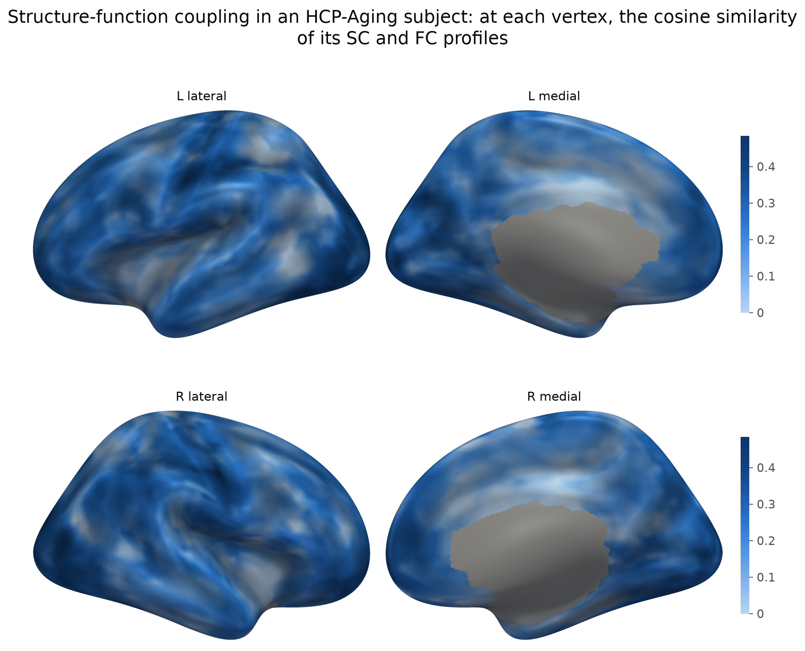
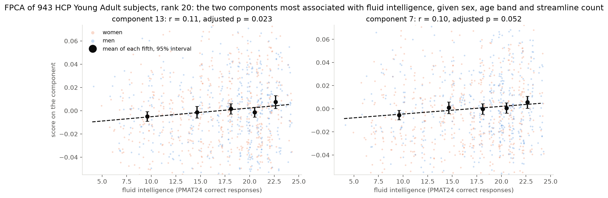
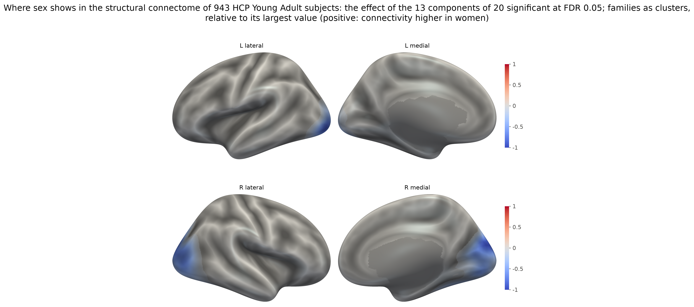
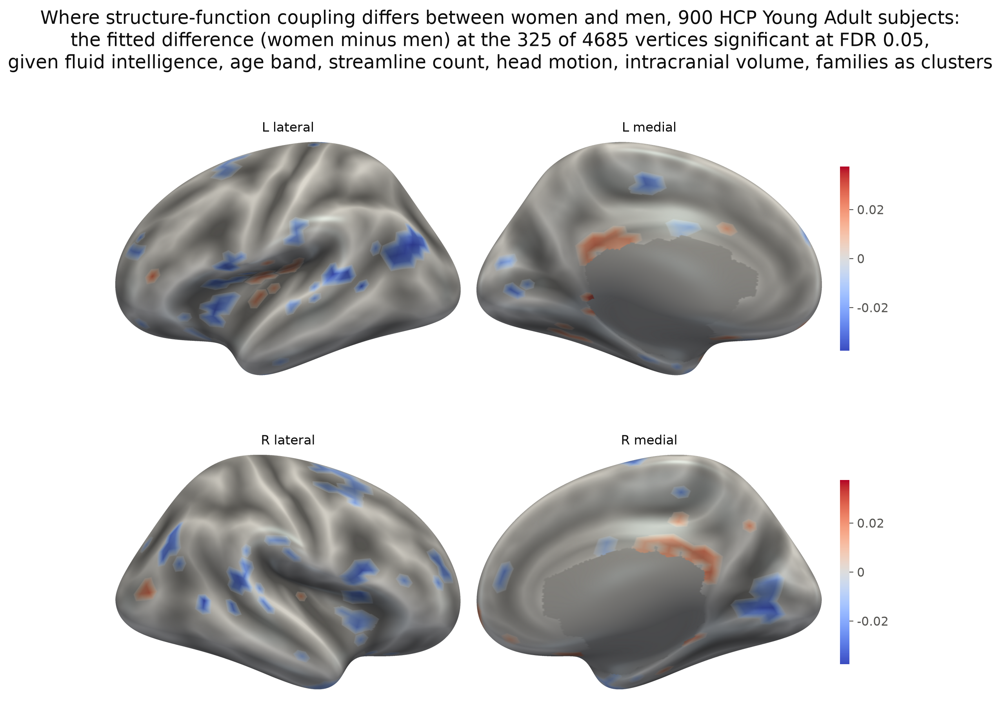

# Results on the released subjects

What the methods do on real data: the figures the package's documents show,
with the measurements behind them. Everything here is drawn from the eleven
HCP Young Adult subjects of the example cohort (`sbci download hcp-ya`) or,
for the cohort analyses, from all 946 young adults with complete pipeline
output, which are not distributed. [USAGE.md](../USAGE.md) shows the calls
behind each figure as worked examples, [PORTING.md](../PORTING.md) records
the measurements, and [figures/README.md](figures/README.md) says how to
regenerate every figure.

## The data behind the figures

The figures are drawn from the eleven young adults of the
example cohort, 22 to 35 years old by the HCP's open-access age bands, and the
single-subject figures from sub-100307, the tutorial subject. All
were rebuilt on the ico4 grid from the lab's pipeline output with
`tools/build_hcp_cohort.py`, their FC from the HCP's resting state with
`tools/build_hcp_fc.py`, and drawn on FreeSurfer's fsaverage surface, rendered with smooth lighting
through PyVista (`plot(mesh="fsaverage", engine="pyvista")`);
`scripts/hcp_figures.py` draws them from a downloaded copy, and
[figures/README.md](figures/README.md) describes each.
The analysis of a whole cohort uses all 946 young adults with complete
pipeline output.

## One subject


*`sc.plot(sc.seed(vertex=1234), mesh="fsaverage", engine="pyvista")`: where one vertex of one
subject connects to. The value at each vertex is the density of streamlines
between the seed (the orange dot, left temporal cortex) and that vertex,
relative to the strongest, on the inflated surface shaded by sulcal depth.*

**What smoothing does.** Tractography gives endpoints. sub-100307's 803,741
streamlines were split into two random halves; 32 of them touch vertex 1234
in one half and 26 in the other. That is few: more streamlines end at 85% of
this subject's cortical vertices. So the two halves' raw counts share little,
and they agree across the cortex at only r = 0.41. Smoothed, they agree at
r = 0.99, and half A's map matches the map from all streamlines at r = 1.00. The kernel pools the streamlines that end near the
vertex, and that is what makes two subjects, or two sessions, comparable
vertex by vertex.


*Top: the far ends of the streamlines that touch the vertex (blue dots), in
the two halves and in the whole set. Bottom: the smoothed density of the same
vertex from each, relative to its strongest vertex.*

**Structure against function.** `sc.coupling(fc)` asks, vertex by vertex, how
closely the cortex a vertex is wired to matches the cortex its activity moves
with: the cosine similarity of its SC and FC profiles. Averaged over the
eleven, coupling is highest in visual cortex (0.36 to 0.41 in the
pericalcarine, cuneus and lateral occipital regions) and lowest in the
cingulate and entorhinal cortex (0.05 to 0.09). It averages 0.30 over primary
and unimodal sensory and motor regions and 0.19 over association regions, the
gradient from sensory to transmodal cortex that coupling is known for
(Vázquez-Rodríguez et al., PNAS 2019; Baum et al., PNAS 2020). The
eleven subjects' maps correlate at r = 0.53 to 0.71.



*`sc.coupling(fc)` for each of the eleven young adults, averaged: at each
vertex, the cosine similarity of its SC and FC profiles, coloured from the
map's 2nd to 98th percentile. The medial wall, which has no cortex, is gray.*

## A cohort: fluid intelligence and sex

The single-subject methods need one subject; the cohort methods need a
cohort. The example subjects are enough to align (below), but not to ask a
question of: an association among eleven people is out of reach. The analysis
here uses all 946 HCP Young Adult subjects with complete pipeline output in
the lab's copy, rebuilt on the ico4 grid as the example subjects were. Only
the eleven are distributed; with HCP access and the pipeline's output,
`tools/build_hcp_cohort.py` builds the rest. The
question is whether fluid intelligence, the number of Penn Matrix Test items
a subject answered correctly (`PMAT24_A_CR` in the HCP's open-access table),
shows in the structural connectome, with sex, age band and the streamline
count in the model. The young adults are not independent: the 946 come from
423 families of twins and siblings, and a test that counts them as
independent makes every p-value too small. `groups=` treats the families as
clusters. Family membership is in the HCP's restricted table, which has its
own data use agreement: it is read at analysis time, and nothing from it is in
this package or its figures.

```python
import csv
from pathlib import Path
import numpy as np
import sbci

table = {f"sub-{r['Subject']}": r for r in csv.DictReader(open("unrestricted.csv"))}  # the HCP's open-access table
family = {f"sub-{r['Subject']}": r["Family_ID"] for r in csv.DictReader(open("RESTRICTED.csv"))}  # restricted
subjects = [p.name.split("_")[0] for p in sorted(Path("hcp-ya-full").glob("sub-*_sc.h5"))]
subjects = [s for s in subjects if table[s]["PMAT24_A_CR"]]    # those with a score
paths = [f"hcp-ya-full/{s}_sc.h5" for s in subjects]
reduction = sbci.reduce(paths, rank=20)                   # FPCA, one file at a time: a batch job, 230 GB
rows = [table[s] for s in subjects]
score = np.array([float(r["PMAT24_A_CR"]) for r in rows])
female = np.array([r["Gender"] == "F" for r in rows], dtype=float)
band = np.array([{"22-25": 23.5, "26-30": 28, "31-35": 33, "36+": 37}[r["Age"]] for r in rows])
count = np.array([sbci.load(p).metadata["streamline_count"] for p in paths]) / 1e6
design = np.column_stack([score, female, band, count])   # column 0 is the intercept local_test adds
groups = [family[s] for s in subjects]
trait = sbci.local_test(reduction.scores, design, terms=[1], groups=groups)   # fluid intelligence
trait.significant()                                       # the components that survive: none
sex = sbci.local_test(reduction.scores, design, terms=[2], groups=groups)     # sex, the trait as nuisance
effect = sex.effect_map(reduction, alpha=0.05)            # one value per vertex, surviving components only
sbci.load(paths[0]).plot(effect, mesh="fsaverage", engine="pyvista")
```

Fluid intelligence is in the data, but too weakly for the components to
carry it once the families are clusters. Streamed once, before any fit
(`tools/age_probe.py`), the 943 subjects with a score show it in the
connectivity strength of 113 of 4,685 cortical vertices at FDR 0.05, never
beyond |r| = 0.17, and in no Desikan region pair. Fit at rank 20, which
captures 27% of the cohort's norm, no component tracks it after the
false-discovery-rate correction across the twenty: the closest, component 13,
correlates with the score at r = 0.11 (adjusted p 0.064), and component 7 at
0.10 (0.083). Counting the 943 as independent would have put component 13 at
0.023 and the vertices at 217; the families are the difference. A rank-4 fit
comes nowhere near (smallest adjusted p 0.32).

Sex, tested in the same model with fluid intelligence as a nuisance, does
show: in 11 of the 20 components, the strongest at adjusted p 2e-8, in all
four of a rank-4 fit, and in 1,020 vertices and 761 Desikan pairs. The effect
map places it at the occipital poles, where connectivity is relatively higher
in men; head size, which differs between the sexes, is not in the model.
PORTING.md item 5 has the measurements.



*The two components of a rank-20 FPCA of 943 HCP Young Adult subjects most
associated with fluid intelligence, given sex, age band and streamline count,
with families as clusters: each subject's score against the number of PMAT24
items answered correctly (women orange, men blue), the mean in each fifth of
that range with its 95% interval, the least-squares line, and the adjusted
p-value. Neither survives the correction.*



*The effect map over the 11 components that track sex, families as clusters,
relative to its largest value: the fitted difference in connectivity between
women and men (positive: higher in women), summed over the other endpoint.*

**Coupling across the cohort.** With FC built for the young adults
(`tools/build_hcp_fc.py`), each of the 903 with four complete resting-state
runs gives a coupling map, and `local_test` takes the 4,685 cortical vertices
as its columns: one test per vertex, families as clusters, with head motion
and intracranial volume added to the model because both shape these measures.

```python
motion = ...   # per subject: Movement_RelativeRMS_mean.txt averaged over the four runs (mm)
volume = ...   # per subject: EstimatedTotalIntraCranialVol from T1w/<id>/stats/aseg.stats (litres)
maps, kept = [], []
for i, s in enumerate(subjects):
    fc = sbci.load(f"hcp-ya-full/{s}_fc.h5")                # tools/build_hcp_fc.py
    if fc.metadata["fc_frames"] == 4800:                      # four complete runs
        maps.append(sbci.load(paths[i]).coupling(fc))
        kept.append(i)
maps = np.array(maps)
cortex = ~np.isnan(maps).any(axis=0)                          # NaN on the medial wall
covariates = np.column_stack([female, score, band, count, motion, volume])[kept]
sex = sbci.local_test(maps[:, cortex], covariates, terms=[1], groups=np.array(groups)[kept])
sex.significant()                                             # vertices, here
```

The cohort's mean map is the eleven's (r = 0.972), and two halves of the
cohort, split by family, reproduce each other's at r = 0.998: the pattern is
settled, and the question is how people depart from it. Fluid intelligence
barely does, at 2 vertices of 4,685 at FDR 0.05, with mean coupling rising
with the score at p 0.036. Sex shows at 325 vertices, 253 of them with
coupling higher in men, in the inferior parietal, superior frontal and
opercular cortex, the insula and early visual cortex. Head size carries most
of the difference: without intracranial volume in the model the count is
1,104, which is reason to read the structural sex effect above, fitted
without it, with the same care. The 72 vertices higher in women are the less
trustworthy part: 44% of them lie within two grid rings of the medial wall,
where 6% of cortex lies, along the isthmus and posterior cingulate, where the
mask drops SC endpoints and the FC fills grid cells the HCP's surface leaves
empty. PORTING.md item 2 has the measurements.



*The fitted difference in structure-function coupling, women minus men, at
the 325 of 4,685 cortical vertices significant at FDR 0.05 among 900 HCP
Young Adult subjects with a fluid-intelligence score and four complete
resting-state runs, given fluid intelligence, age band, streamline count,
head motion and intracranial volume, families as clusters. Blue: higher in
men.*

## Alignment

Alignment fits in front of `reduce`: `sbci.align(subjects)` (ENCORE) returns
the warped densities as `aligned`, and `sbci.endpoints_align(subjects)`
(ConSEAL) warps every subject's endpoints onto a common template,
`aligned_endpoints(i)` hands them back, and `smooth()` turns them into aligned
connectomes (USAGE.md shows the three lines).

**Alignment, with a known answer.** The endpoints of sub-100307's 803,741
streamlines were moved by a known smooth warp, a random field of
spherical harmonic degree up to four that moves the grid's vertices 1.7
degrees on average and 4 at most,
and the deformed copy was registered back onto the undeformed subject, both
through the package's smoother. ENCORE, searching its default degree-6 basis,
undoes 88% of the displacement in eleven steps: the endpoints come back from
1.63 to 0.20 degrees, and the cost falls to 0.15 of its start. ConSEAL, with
the unregularized update (the public code without its clamp and smoothing) and
a stopping threshold of 1e-7, brings them to
within 0.11 degrees, 93%, in sixty iterations. The figure shows, vertex by
vertex, how far the endpoints still are from where they started. Two rules
this test taught, measured in PORTING.md item 7: build every density from the
same endpoints through the same smoother, and judge a registration by a warp
it can represent.


**Carrying the warp to another template.** The warp ENCORE found on the grid
is an anatomical correspondence, and it applies to anything of the same
subject on another sphere. The map carried here is sub-100307's own sulcal
depth from its FreeSurfer reconstruction, at fsaverage resolution (163,842
vertices per hemisphere): a measure of anatomy the tractography never sees.
The known warp of the recovery figure moved it to a correlation of 0.95 with
the original. ENCORE's warp, estimated from connectivity on 5,124 vertices and
restated on fsaverage by `sbci.migrate_warp`, put it back to 0.996, and on
fsaverage it sits 0.33 degrees from the true warp over both hemispheres (0.32
on the left one the figure shows), which moved fsaverage's vertices 1.58
degrees on average. The figure shows the map, and what each warp
changes in it.


**Alignment and the analysis.** What aligning first does to an association
is measured against a planted answer in PORTING.md items 5 and 7: with the
cohort's anatomy jittered by three degrees the planted effect slips past a
rank-4 FPCA's default start, `candidates=6` reaches it, ENCORE puts it first,
and ConSEAL keeps it with its default regularization or a mean template.

**Aligning the eleven subjects.** Registered onto a template estimated from
the cohort, with every density from the package's smoother, the subjects grow
more alike: the mean correlation between two subjects' connectomes rises from
0.716 to 0.761 after ten ENCORE iterations and to 0.784 after thirty ConSEAL
iterations, and the cost falls for every subject. Each method registers onto
its own Karcher median; ConSEAL's sits 17 to 20 degrees from every subject
and 0.4 from the mean of their square-root densities. Until October 2026 it
stopped on sub-212116 instead, 0.001 degrees from it and 24 to 27 from the
others, which these notes first put down to the subjects' geometry; it was a
rounding defect the port shared with the reference (PORTING.md item 9), and
this figure registered ConSEAL onto that mean instead, reaching 0.785. Eleven
subjects with 734,039 to 988,788 streamlines each take nine minutes with
ENCORE and two hours with ConSEAL on eight cores.


*Left: each subject's registration cost per iteration, relative to its start,
for ENCORE and ConSEAL. Right: the correlation between the connectomes of
each of the 55 pairs of subjects before alignment and after each method, with
the mean.*
